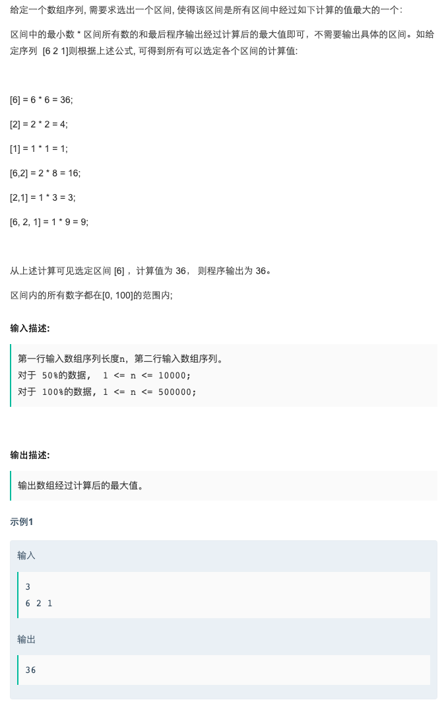

# 18校招测试开发方向(第一批)编程题2   
### 题目描述   
   
### 解题思路   

看到题目就先想到了前缀和，然后区间最小值查询我又想到了线段树，然后花了20分钟写好。然后发现TL了😂

😢 下边是车祸现场。

### code(TL)
```cpp    
#include <iostream>
#include <map>
#include <stack>
#include <queue>
#include <math.h>
#include <set>
#include <algorithm>

using namespace std;

struct tree {
    int min;
    int start, end;
    tree *left;
    tree *right;

    tree(int start, int end) {
        this->start = start;
        this->end = end;
        left = NULL;
        right = NULL;
    }
};

tree *build(vector<int> &num, int start, int end) {
    if (start > end)return NULL;
    tree *root = new tree(start, end);
    if (start == end) {
        root->min = num[start];
        return root;
    }
    int mid = start + (end - start) / 2;
    root->left = build(num, start, mid);
    root->right = build(num, mid + 1, end);
    root->min = min(root->left->min, root->right->min);
    return root;
}

int search(tree *root, int start, int end) {
    if (start > root->end || end < root->start)return 200;
    if (start <= root->start && end >= root->end)return root->min;
    return min(search(root->right, start, end), search(root->left, start, end));
}

int main() {
    int n;
    cin >> n;
    vector<int> nums(n);
    vector<int> sum(n, 0);
    long long ans = -1;
    for (int i = 0; i < n; i++) {
        cin >> nums[i];
        if (i)sum[i] = sum[i - 1] + nums[i];
        else sum[i] = nums[i];
        ans = ans > nums[i] * nums[i] ? ans : nums[i] * nums[i];
        ans = max(ans, (long long) (nums[i] * nums[i]));
    }
    tree *root = build(nums, 0, nums.size() - 1);
    for (int i = 0; i < nums.size(); i++) {
        for (int j = i + 1; j < nums.size(); j++) {
            ans = max(ans, (long long) (search(root, i, j) * (sum[j] - sum[i] + nums[i])));
        }
    }
    cout << ans;
    return 0;
}
```

接下来是大牛的解决方案。xuo xi 一下😂

#### 大佬思路

> 那么在一个给定的区间最小值情况下，最优情况一定是这个区间尽可能的延伸，直至区间最小值不满足给定值。
> 题目中数组里的数范围是[0, 100]。所以我们对每一个可能的区间最小值扫描一遍数组，每找到一个符合条件的区间就更新答案。

 下边的代码我修改了一下，原来的写法感觉不太容易理解😂

```cpp

#include <iostream>
#include <map>
#include <stack>
#include <queue>
#include <math.h>
#include <set>
#include <algorithm>

using namespace std;
const int MAX_N = 5e5 + 5;
int a[MAX_N];

int main() {
    long long ans, sum;
    int n, minnum;
    scanf("%d", &n);
    for (int i = 0; i < n; i++) {
        scanf("%d", &a[i]);
    }
    a[n] = 0;
    ans = 0;
    for (int j = 100; j >= 1; j--) {
        //sum = 0, minnum = 101;（原来的
        sum=0;
        for (int i = 0; i <= n; i++) {
            if (a[i] < j) {
               // ans = max(ans, sum * minnum);（原来的
                ans = max(ans, sum * j);
               // minnum = 101, sum = 0;
              sum=0;
            } else {
              // a[i]>j
                sum += a[i];
                //minnum = min(minnum, a[i]);（原来的
            }
            //printf("i = %d, j = %d, ans = %lld\n", i, j, ans);
        }

    }
    printf("%lld\n", ans);
    return 0;
}
```

