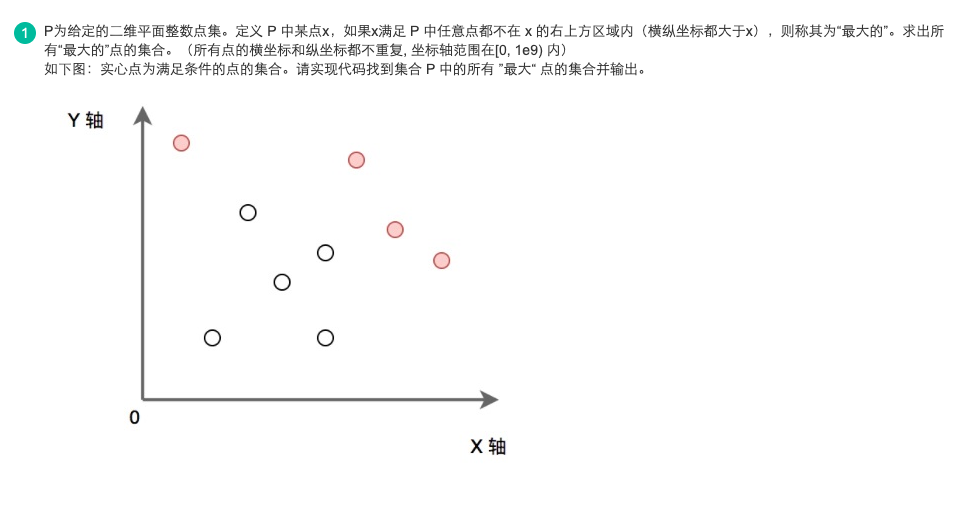
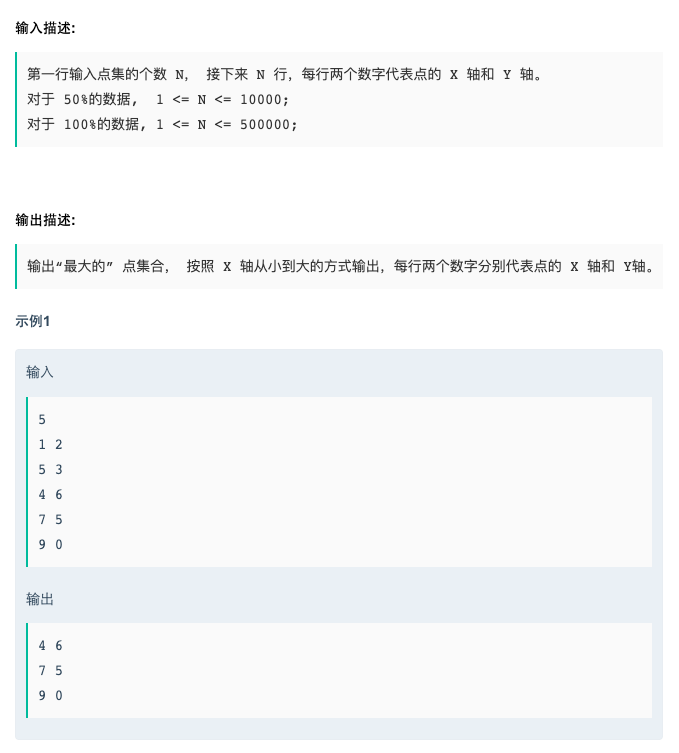

# 18校招测试开发方向(第一批)编程题1   
### 题目描述   
   



### 解题思路   

不要使用cin 会超时

按照Y坐标的降序排列 然后遍历

遍历过程中 当前点的Y坐标肯定小于上一点，所以只要当前点的X坐标大于前面遍历过所有点的X坐标 则这个点就符合要求

### code    

```cpp    
#include <iostream>
#include <map>
#include <stack>
#include <queue>
#include <math.h>
#include <set>
#include <algorithm>

using namespace std;

int main() {
    int n;
    while (scanf("%d",&n)!=EOF) {
        vector<pair<int, int>> v(n);
        int a, b;
        for (int i = 0; i < n; i++) {
            scanf("%d %d", &a, &b);
            v[i] = make_pair(a, b);
        }
        sort(v.begin(), v.end(), [](const pair<int, int> &a, const pair<int, int> &b) {
            return a.second > b.second;
        });
        int maxx = -1;
        for (auto &it : v) {
            if (it.first > maxx) {
                cout << it.first << " " << it.second << endl;
                maxx = it.first;
            }
        }
    }

    return 0;
}
```
