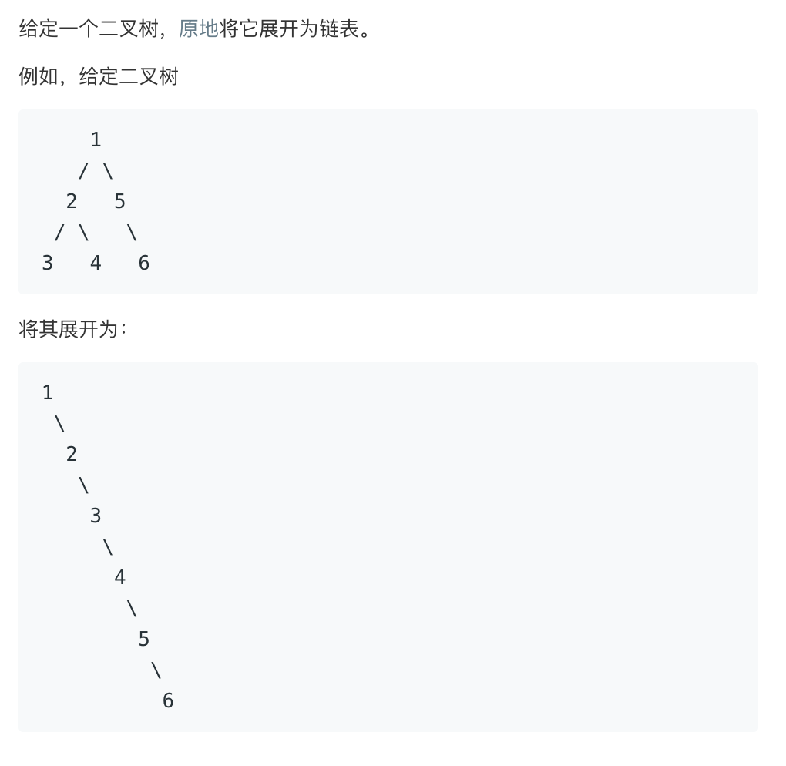

# 114.Flatten Binary Tree to Linked List   
### 题目描述   


### 解题思路

好奇怪 本地跑没问题 放leetcode上报错`AddressSanitizer: heap-use-after-free on address `这尼玛……

`TreeNode *dfs(TreeNode *root)` 传入一个树根，把这棵树撸成链表😂然后返回链表的尾巴

```cpp
class Solution {
public:
    void flatten(TreeNode *root) {
        dfs(root);
    }

    TreeNode *dfs(TreeNode *root) {
        if (!root)return NULL;

        TreeNode *ltail = dfs(root->left);
        TreeNode *rtail = dfs(root->right);

        if (!ltail && !rtail)return root;
        if (!ltail && rtail)return rtail;
        if (!rtail && ltail) {
            root->right = root->left;
            return ltail;
        }

        TreeNode *right = root->right;
        root->right = root->left;
        ltail->right = right;

        return rtail;
    }
};
```

