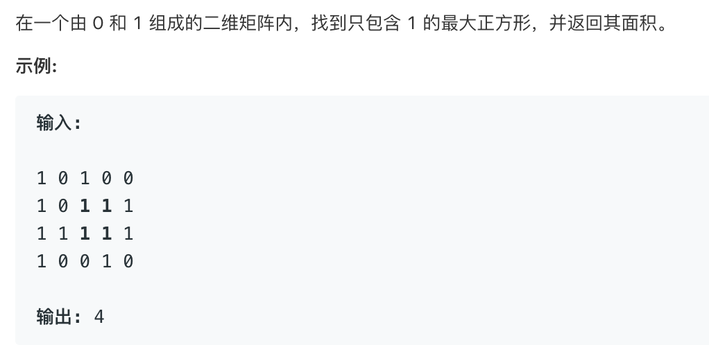
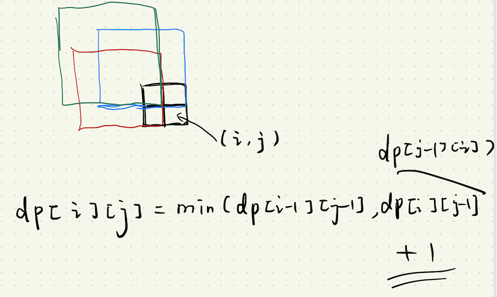

# 221.最大正方形   
### 题目描述   



### 解题思路

动态规划



状态方程`dp[i][j]=min(dp[i-1][j-1],min(dp[i-1][j],dp[i][j-1]))+1;`

`dp[i][j]`表示以点`i,j`为右下角的最大正方形边长

```cpp
class Solution {
public:
    int maximalSquare(vector<vector<char>>& matrix) {
        if(matrix.size()==0)return 0;
        vector<vector<int>>dp(matrix.size(),vector<int>(matrix[0].size(),0)); 
        int ans=0;
        for(int i=0;i<matrix.size();i++){
            dp[i][0]=(matrix[i][0]=='1'?1:0);
            ans=max(ans,dp[i][0]);
        }
        for(int i=0;i<matrix[0].size();i++){
            dp[0][i]=(matrix[0][i]=='1'?1:0);
            ans=max(ans,dp[0][i]);
        }
        for(int i=1;i<matrix.size();i++){
            for(int j=1;j<matrix[0].size();j++){
                if(matrix[i][j]=='0')continue;
                dp[i][j]=min(dp[i-1][j-1],min(dp[i-1][j],dp[i][j-1]))+1;
                ans=max(ans,dp[i][j]);
            }
        }
        return ans*ans;
    }
};
```

