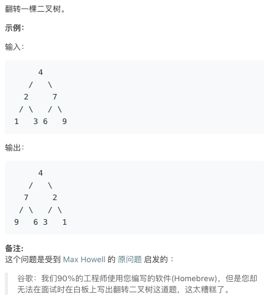

# 226.Invert Binary Tree   
### 题目描述

###    

### 解题思路

QAQ

```cpp
/**
 * Definition for a binary tree node.
 * struct TreeNode {
 *     int val;
 *     TreeNode *left;
 *     TreeNode *right;
 *     TreeNode(int x) : val(x), left(NULL), right(NULL) {}
 * };
 */
class Solution {
public:
    TreeNode* invertTree(TreeNode* root) {
        if(!root)return NULL;
        auto left=root->left;
        root->left=invertTree(root->right);
        root->right=invertTree(left);
        return root;
    }
};
```

