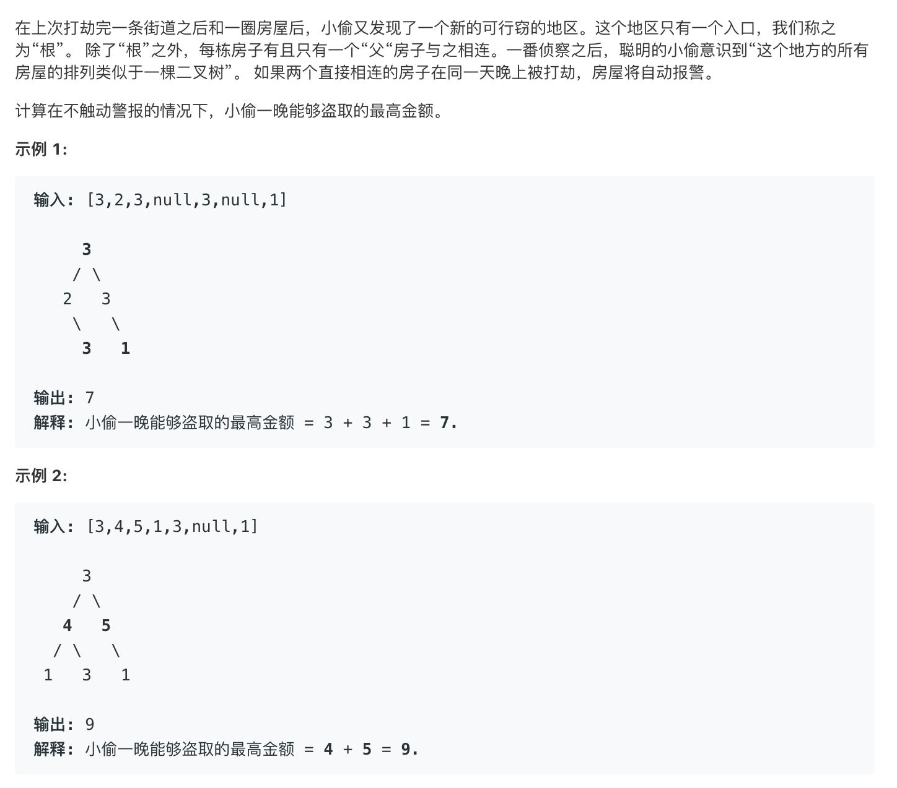

# 337.House Robber III   
### 题目描述   



### 解题思路

递归求解

函数`robutil(TreeNode* root,int&withroot,int&withoutroot)` 传入一个根，两个引用

运行结束以后，包含根的最优解存在withroot中，不包含根的最优解保存在withoutroot中

拿到一个根，对其两个子节点执行robutil操作

对于其左子树 包含左子的最优解为`lw`不包含左子的最优解为`lwo`

对于其右子树 包含右子的最优解为`rw`不包含右子的最优解为`rwo`

所以对于当前`root` 包含自身的最优解为`root->val+lwo+rwo`

不包含自身的最优解为`max(lw,lwo)+max(rw,rwo)`

😄

### code

```cpp
/**
 * Definition for a binary tree node.
 * struct TreeNode {
 *     int val;
 *     TreeNode *left;
 *     TreeNode *right;
 *     TreeNode(int x) : val(x), left(NULL), right(NULL) {}
 * };
 */
class Solution {
public:
    int rob(TreeNode* root){
        int wi,wo;
        robutil(root,wi,wo);
        return max(wi,wo);
    }
    void robutil(TreeNode* root,int&withroot,int&withoutroot) {
        if(!root){
            withroot=withoutroot=0;
            return; 
        }
        bool useleft,useright;

        int lw=0,lwo=0;
        int rw=0,rwo=0;
        
        robutil(root->left,lw,lwo);
        robutil(root->right,rw,rwo);
       
        withroot=root->val+lwo+rwo;
        withoutroot=max(lw,lwo)+max(rw,rwo);
        
    }
};
```


### 运行结果

