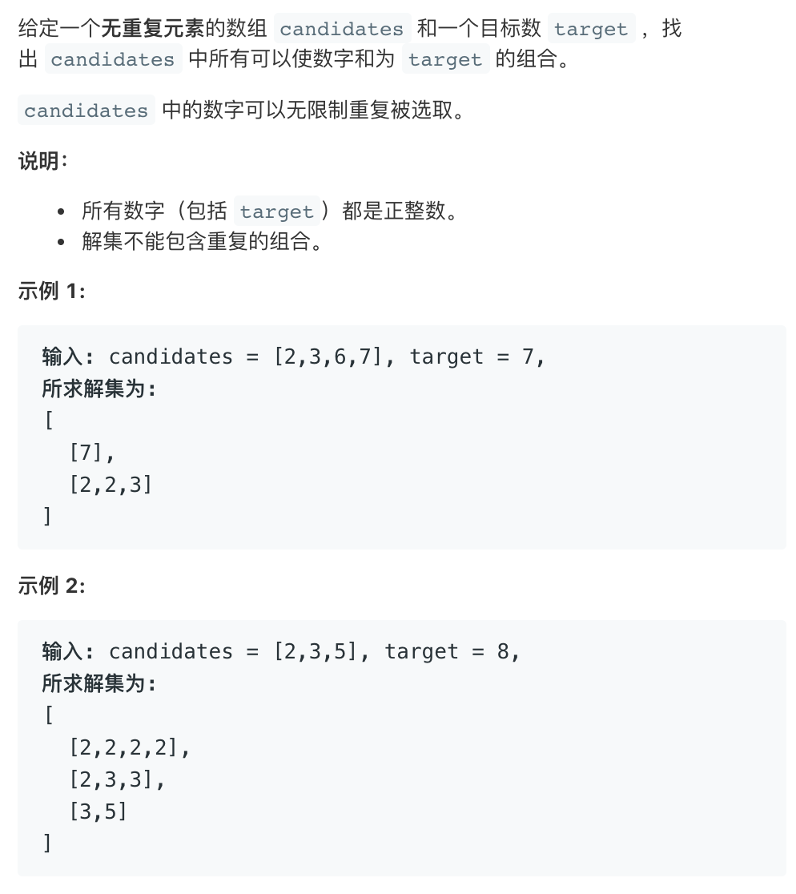

# 39.Combination Sum   
### 题目描述   


### 解题思路

深搜+剪枝题

这次想用dp做，结果姿势不太好QAQ 菜哭了

```cpp
class Solution {
public:
    vector<vector<int>> combinationSum(vector<int> &candidates, int target) {
        if (candidates.size() == 0 || !target)return vector<vector<int>>(0);
        vector<vector<vector<int>>> dp(target + 1);
        sort(candidates.begin(), candidates.end());
        if (candidates[0] > target)return vector<vector<int>>(0);
        dp[candidates[0]] = vector<vector<int>>(1, vector<int>{candidates[0]});

        for (int tar = candidates[0]; tar <= target; tar++) {
            for (int cand:candidates) {
                if (tar < cand)break;
                if (dp[tar - cand].size()) {
                    for (auto it:dp[tar - cand]) {
                        it.push_back(cand);
                        sort(it.begin(), it.end());// 排序一下
                        dp[tar].push_back(it);
                    }
                } else if (tar == cand) {
                    dp[tar].push_back(vector<int>(1, cand));
                }
            }
        }
        if (dp[target].size()) {
            set<vector<int>> vs(dp[target].begin(), dp[target].end());
            dp[target].assign(vs.begin(), vs.end());
        }
        return dp[target];
    }
};
```

