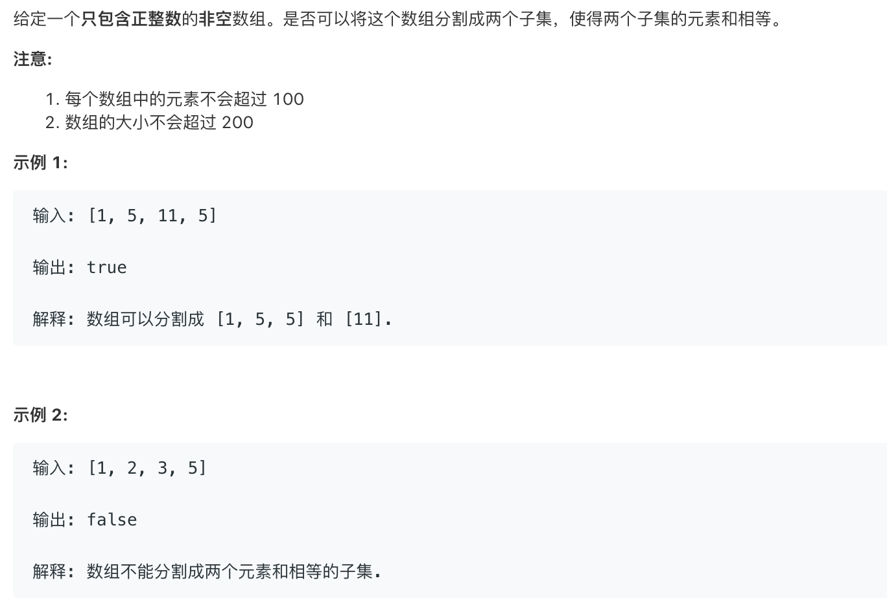
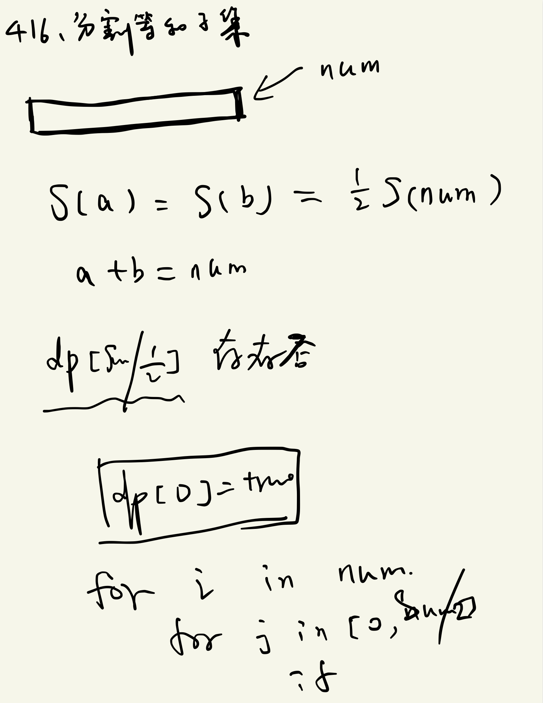

# 416.分割等和子集   
### 题目描述   



### 解题思路



```cpp

class Solution {
public:
    bool canPartition(vector<int>& nums) {
        int len=nums.size();
        int sum=0;
        for(auto& n:nums)sum+=n;
        if(sum%2)return false;
        
        int size=sum/2;
        bool*dp=new bool[size+1]();
        memset(dp,sizeof(bool)*(size+1),0);
        dp[0]=true;
        for(auto&n:nums){
            // 注意这个是从后边开始
            // 否则一个数会被用多次
            for(int i=size;i>=n;i--){
                if(!dp[i]){
                    dp[i]=dp[i-n];
                }
            } 
            if(dp[size])return true;
        }
        return false;
    }
};
```

