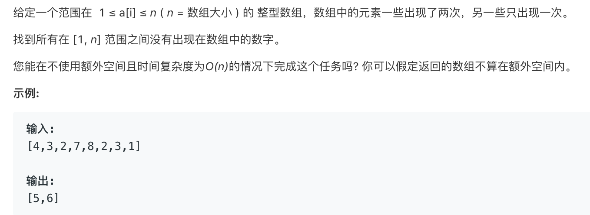

# 448.找到所有数组中消失的数字   
### 题目描述   



### 解题思路

遍历数组

对于每一个出现的数字 x 

进行如下操作 num[(x-1)%len(num)]+=len(num)

所以如果一个数字出现过 那么把它作为index 其num[index]的值必然大于len

```cpp

class Solution {
public:
    vector<int> findDisappearedNumbers(vector<int>& nums) {
        int len=nums.size();
        if(!len)return nums;
        for(int i=0;i<len;i++){
            cout<<nums[i]<<endl;
            int index=(nums[i]-1)%len;
            nums[index]+=len; 
        }
        vector<int>ans(0);
        for(int i=0;i<len;i++){
            if(nums[i]<=len)ans.push_back(i+1);
        }
        return ans;
    }
};
```

