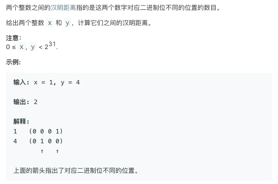
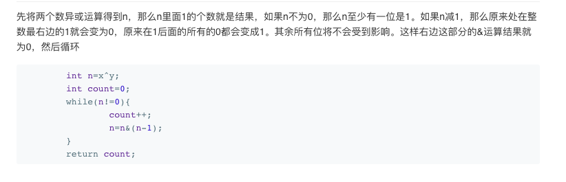

# 461.Hamming Distance   
### 题目描述   



### 解题思路

今天好累，但是还是得坚持每天一道题。所以就做了俩简单题，滑水

```cpp
class Solution {
public:
    int hammingDistance(int x, int y) {
        int m=max(x,y);
        int n=min(x,y);
        int ans=0;
        while(m){
           if(((m&1)^(n&1)))ans++;
           m>>=1;
           n>>=1;
        }
        return ans;
    }
};

```


还看到了一个不错的方法

