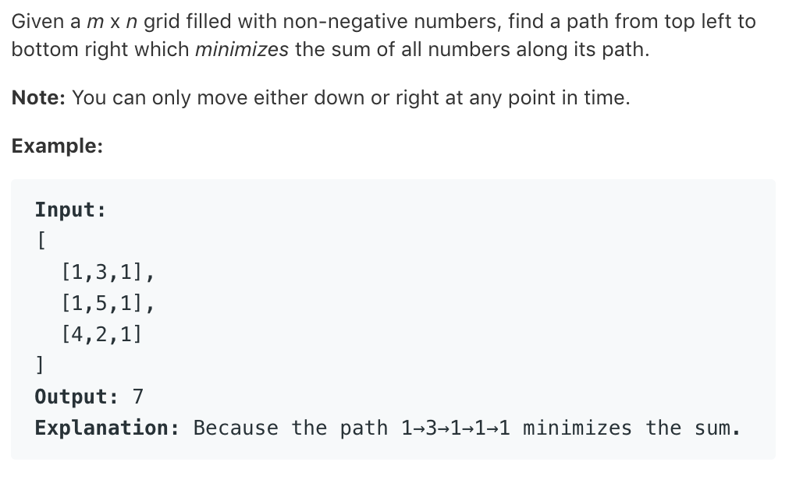

# 64.Minimum Path Sum   
### 题目描述   



### 解题思路

动态规划+滚动数组

状态转移方程`dp[i][j]=min(dp[i][j-1],dp[i-1][j])+grid[i][j]`

每一层的值的更新 只和上一层有关。 所以可以用一个一维数组`dp[]`

```cpp
class Solution {
public:
    int minPathSum(vector<vector<int>>& grid) {
        vector<int>dp(grid[0].begin(),grid[0].end());
						for(int i=1;i<dp.size();i++)dp[i]+=dp[i-1];
						for(int i=1;i<grid.size();i++)
						for(int j=0;j<grid[i].size();j++){
								if(j){
										dp[j]=min(dp[j],dp[j-1])+grid[i][j];
								}else{
										dp[j]+=grid[i][j];
								}
						}
						return dp.back();
    }
};
```


### 运行结果

好慢……😂

