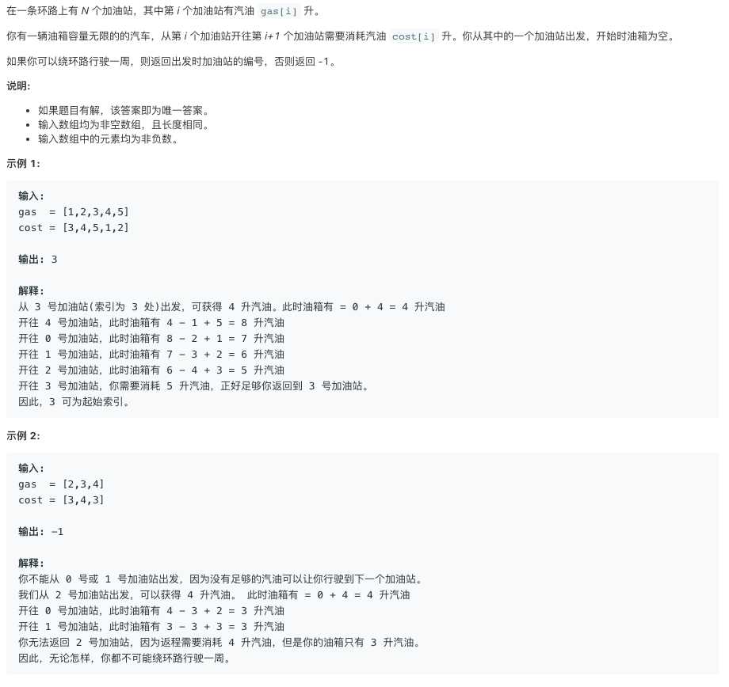

# TOP134.Gas Station   
### 题目描述   



### 解题思路

c++无脑版本

```cpp
class Solution {
public:
    int canCompleteCircuit(vector<int>& gas, vector<int>& cost) {
        for(int i=0;i<gas.size();i++){
            if(solve(gas,cost,i,i+1,0))return i;
        }
        return -1;
    }
    bool solve(vector<int>& gas, vector<int>& cost,int start,int cur,int g){
        int f = (cur-1+cost.size())%cost.size(); 
        if(cur==start){
            return g+gas[f]>=cost[f];    
        }
        if(cost[f]>g+gas[f])return false;
        return solve(gas,cost,start,(cur+1)%cost.size(),g+gas[f]-cost[f]);
    }
};
```

```go

```

