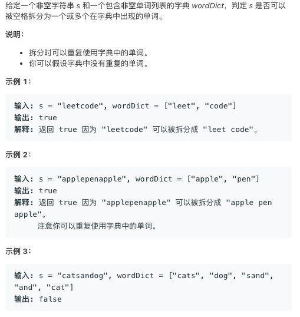

# TOP139.Word Break   
### 题目描述   
   

### 解题思路

深搜题，细心敲代码就行了。写的有点臭长😂

```cpp
class Solution {
public:
    set<string> _set;
    set<int> _size;
    map<string, bool> ok;
    int *size;


    bool wordBreak(string s, vector<string> &wordDict) {
        this->_set.clear();
        for (string str:wordDict) {
            this->_set.insert(str);
            this->_size.insert(str.length());
        }
        this->size = new int[this->_size.size()];
        int index = this->_size.size() - 1;
        for (auto it = this->_size.begin(); it != this->_size.end(); it++) {
            this->size[index--] = *it;
        }
        return dfs(s);
    }

    bool dfs(string str) {
        if (str.length() == 0)return true;
        if (ok.count(str)) {
//            cout << "hhh";
            return ok[str];
        }
        for (int i = this->_size.size() - 1; i >= 0; i--) {
            if (this->size[i] > str.length())continue;
            if (_set.count(str.substr(0, this->size[i]))) {
                if (dfs(str.substr(this->size[i]))) {
                    ok[str] = true;
                    return true;
                }
                ok[str] = false;
            }
        }
        return false;
    }
};
```

