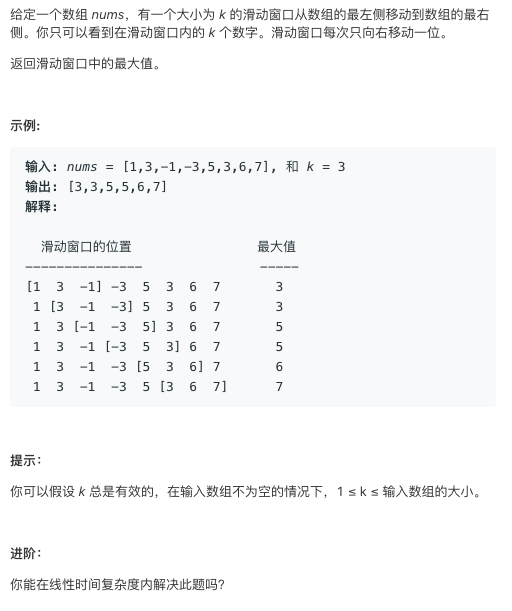

# TOP239.Sliding Window Maximum   
### 题目描述   
   

### 解题思路

 写一个getMax 的函数 ，该函数可计算窗口中最大值

每次移动窗口，看看进入窗口的数字是不是大于当前的最大值，如果大于，则更新最大值

否则，得查看从窗口离开的那个数是不是最大值，是的话，得重新找最大值 

代码和运行结果如下。

```cpp
class Solution {
public:
    vector<int> maxSlidingWindow(vector<int>& nums, int k) {
        int s=0,e=k-1;
        vector<int>ans;
        if(k==0||nums.size()==0)return ans;
        int _max=getMax(s,e,nums);
        ans.push_back(_max);
        for(++e;e<nums.size();e++){
            // 看看加进来的这个有没有比_max大
            if(nums[e]>_max)_max=nums[e];
            else{
                // 看看减少的是不是_max
                if(_max==nums[s]){
                    _max=getMax(s+1,e,nums);
                }
            }
            s++;
            ans.push_back(_max);
        }
        return ans;
    }
    int getMax(int s,int e,vector<int>&nums){
        int _max=nums[s];
        for(int i=s+1;i<=e;i++)
            _max=max(_max,nums[i]);
        return _max; 
    }
};
```

### 运行结果

