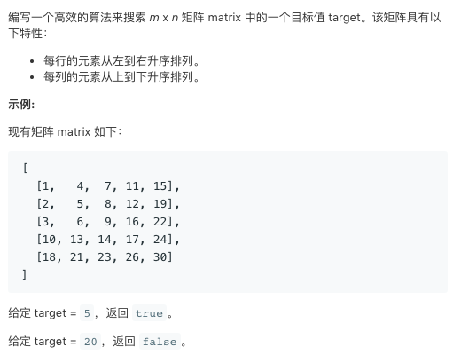

# TOP240 Search a 2D Matrix II   
### 题目描述   
   

### 解题思路

从（0，0）开始，对行和列二分搜索，如果没搜到，就从（1，1）开始对行和列二分搜索

重复 直到找到或是 越界

```go


func searchMatrix(matrix [][]int, target int) bool {
	if len(matrix)==0{
		return false
	}
	if len(matrix[0])==0{
		return false
	}
	for i := 0; i < len(matrix) && i < len(matrix[0]); i++ {
		if searchColum(matrix, target, i) {
			return true
		}
		if searchLine(matrix, target, i) {
			return true
		}
	}
	return false
}

func searchLine(matrix [][]int, target, line int) bool {
	low := line
	high := len(matrix[0])

	for {
		if low >= high {
			return false
		}
		mid := low + (high-low)/2
		if matrix[line][mid] == target {
			return true
		}
		if matrix[line][mid] > target {
			high = mid
		} else {
			low = mid + 1
		}
	}
}

func searchColum(matrix [][]int, target, column int) bool {
	low := column
	high := len(matrix)
	for {
		if low >= high {
			return false
		}
		mid := low + (high-low)/2
		if matrix[mid][column] == target {
			return true
		}
		if matrix[mid][column] > target {
			high = mid
		} else {
			low = mid + 1
		}
	}
}
```

