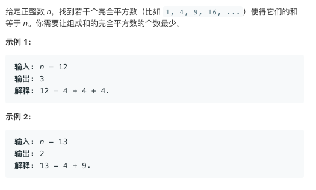

# TOP279.Perfect Squares   
### 题目描述   
   

### 解题思路

用了点贪心 + BFS

每次都尽可能减去最大的平方数 把剩下的部分 入队列

```cpp
class Solution {
public:
    int numSquares(int n) {
        queue<int> qq;
        qq.push(0);
        int step = 0;
        queue<int> next;
        while (!qq.empty()) {
            int tmp = qq.front();
            qq.pop();
            for (int i = sqrt(n - tmp); i >= 1; i--) {
                if (tmp + i * i == n) {
                    return step + 1;
                }
                next.push(tmp + i * i);
            }
            if (qq.empty()) {
                swap(qq, next);
                step++;
            }
        }
        return n;
    }
};
```

