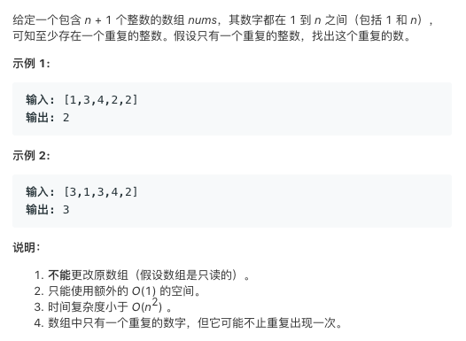

# TOP287.Find The Duplicate Number   
### 题目描述   
   

### 解题思路

排序 就行

如果有相同的元素 排序后肯定是紧挨着的

```cpp
class Solution {
public:
    int findDuplicate(vector<int>& nums) {
        sort(nums.begin(),nums.end());
        int i=1;
        for(;i<nums.size();i++){
            if(nums[i]==nums[i-1]){
                return nums[i];
            }
        }
        return 0;
    }
};
```

