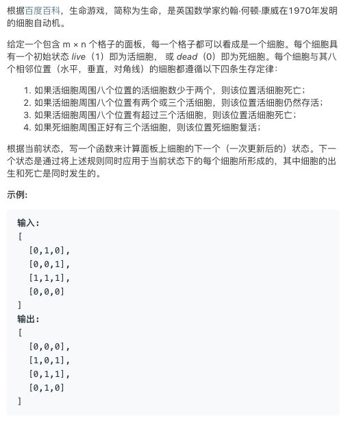
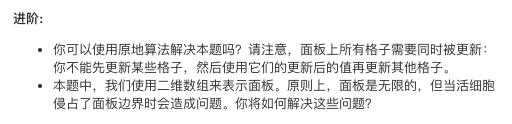

# TOP289.Game of Life   
### 题目描述   
   

### 解题思路

模拟题 只需要按照描述打出来就行了

不过写的太臭长了😂



不过我写的这个算法使用原地算法解决了

通过打标签的形式 先打标签 110 101并没有讲究  没有实际意义 瞎几把写的  写啥都行 能区分开就行了

最后统一遍历更改 更改

```cpp
class Solution {
public:
    int dirx[8] = {-1, -1, 0, 1, 1, 1, 0, -1};
    int diry[8] = {0, 1, 1, 1, 0, -1, -1, -1};

    void gameOfLife(vector<vector<int>> &board) {
        for (int i = 0; i < board.size(); i++) {
            for (int j = 0; j < board[0].size(); j++) {
                getNum(i, j, board);
            }
        }
        for (int i = 0; i < board.size(); i++) {
            for (int j = 0; j < board[0].size(); j++) {
                if (board[i][j] == 110) {
                    board[i][j] = 0;
                } else if (board[i][j] == 101) {
                    board[i][j] = 1;
                }
            }
        }
    }

    void getNum(int x, int y, vector<vector<int>> &board) {
        int count = 0;
        int newx, newy;
        for (int i = 0; i < 8; i++) {
            newx = x + dirx[i];
            newy = y + diry[i];
            if (newx < 0 || newx >= board.size() || newy < 0 || newy >= board[0].size()) continue;
            if (board[newx][newy] == 1 || board[newx][newy] == 110) {
                count++;
            }
        }
        if (count < 2) {
            if (board[x][y] == 1) {
                board[x][y] = 110;//标记死亡 1->0
            }
        } else if (count > 3) {
            if (board[x][y] == 1) {
                board[x][y] = 110; //标记死亡 1->0
            }
        } else {
            if (count == 3) {
                if (board[x][y] == 0) {
                    board[x][y] = 101;//标记复活 0->1
                }
            }
        }
    }
};
```

