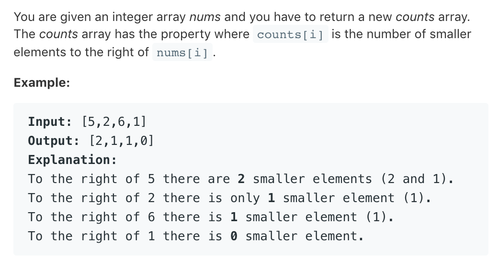

# TOP315.Count of Smaller Number After Self   
### 题目描述   


### 思路

- 暴力
   ```cpp
    class Solution {
    public:
        vector<int> countSmaller(vector<int>& nums) {
            vector<int>ans;
            for(int i=0;i<nums.size();i++){
                int num=0;
                for(int j=i+1;j<nums.size();j++){
                if(nums[i]>nums[j])num++; 
                }
                ans.push_back(num);
            }
            return ans;
        }
    };
   ```
- 插入排序
```cpp
class Solution {
public:
    vector<int> countSmaller(vector<int>& nums) {
        if(nums.size()==0)return vector<int>();
        vector<int>ans(nums.size(),0);        
        vector<int> sortedList;
        sortedList.push_back(nums.back());
        for(int i=nums.size()-2;i>=0;i--){
            auto it=upper_bound(sortedList.begin(),sortedList.end(),nums[i]);
            ans[i]=it-sortedList.begin();
            sortedList.insert(it,nums[i]);
        }
        return ans;
    }
};

```
- 二叉树
```cpp
struct tree{
    int less_than;
    int value;
    int size;
    tree* left;
    tree* right;
    tree(int v){
        less_than=0;
        value=v;
        size=1;
        left=NULL;
        right=NULL;
    }
    int insert(int num){
        if(num==value){
            size++;
            return less_than;
        }
        else if(num>value){
            if(right)return less_than+size+right->insert(num);
            right=new tree(num);
            return less_than+size;
        }
        else{
            less_than++;
            if(left) return left->insert(num);
            left=new tree(num);
            return 0;
        }
    }
};

class Solution {
public:
    vector<int> countSmaller(vector<int>& nums) {
        if(nums.size()==0)return vector<int>{};
        tree*root=new tree(nums.back());
        vector<int>ans(nums.size(),0);
        for(int i=nums.size()-2;i>=0;i--){
            ans[i]=root->insert(nums[i]);
        }
        return ans;
    }
};


```


插入排序每次插入，数组要一起向后移动，效率不及二叉树

插入排序的思想大概是 每次取原始数组的最后一个元素加入到有序队列中，因为有序队列中的元素在该元素之前（也就是在原始数组里，在该元素之后）所以可以计算出该元素后边比他小的元素的个数

二叉树的做法大概是每个节点中存一个值表示比该值小的节点的数量，同样是从原始数组后边取元素依次插入树中