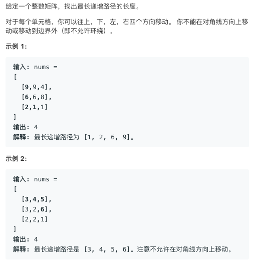

# TOP329.Longest Increasing Path in a Matrix   
### 题目描述   
   

### 解题思路

这个题目之前做过 类似的 。题目描述不同，解题过程完全相同

可以用动态规划做，先按高度排序，从小的开始递推

假设`dp[i][j]` 表示 从未知点移动到点`i,j`的长度

那么如果点`i,j+1`的高度比`i,j`高 ，则 `dp[i][j+1]=max(dp[i][j+1],dp[i][j]+1)`

```cpp
class Solution {
public:
    int dirx[4]={
        -1,1,0,0
    };
    int diry[4]={
        0,0,-1,1
    };
    int longestIncreasingPath(vector<vector<int>>& matrix) {
        if(matrix.size()==0)return 0;
        vector<vector<int>>v(matrix.size(),vector<int>(matrix[0].size(),1));
        vector<pair<int,pair<int,int>>>order;
        for(int i=0;i<matrix.size();i++){
            for(int j=0;j<matrix[i].size();j++){
                order.push_back(make_pair(matrix[i][j],make_pair(i,j)));
            }
        }
        sort(order.begin(),order.end(),[](const pair<int,pair<int,int>>&a,const pair<int,pair<int,int>>&b){
            return a.first<b.first;
        });
        
        int ans=1;
        for(auto it:order){
            //cout<<it.first<<endl;
            int x=it.second.first;int y=it.second.second;
            for(int i=0;i<4;i++){
                if(x+dirx[i]<0||x+dirx[i]>=matrix.size())continue;
                if(y+diry[i]<0||y+diry[i]>=matrix[0].size())continue;
                int nx=x+dirx[i];
                int ny=y+diry[i];
                if(matrix[nx][ny]>matrix[x][y]){
                     v[nx][ny]=max(v[nx][ny],v[x][y]+1);
                    ans=max(ans,v[nx][ny]);
                }
            }
        }
        return ans;
    }
};
```

