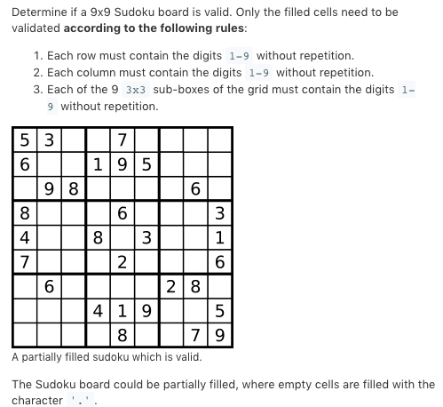

# TOP36.Valid Sudoku   
### 题目描述   
   

### 解题思路

粗暴 直接上set 

```cpp
class Solution {
public:
    set<int>column[10];
    set<int>line[10];
    set<int>square[10];
    bool isValidSudoku(vector<vector<char>>& board) {
        int i,j;
        for(i=0;i<9;i++)
        for(j=0;j<9;j++){
            if(board[i][j]!='.'){
                // cout<<i<<"  "<<j<<endl;
                if(column[j].count(board[i][j]-'0'))return false;
                if(line[i].count(board[i][j]-'0'))return false;
                if(square[(i/3)*3+j/3].count(board[i][j]-'0'))return false;
                column[j].insert(board[i][j]-'0');
                line[i].insert(board[i][j]-'0');
                square[(i/3)*3+j/3].insert(board[i][j]-'0');
            }
        }
        return true;
    }
};
```

