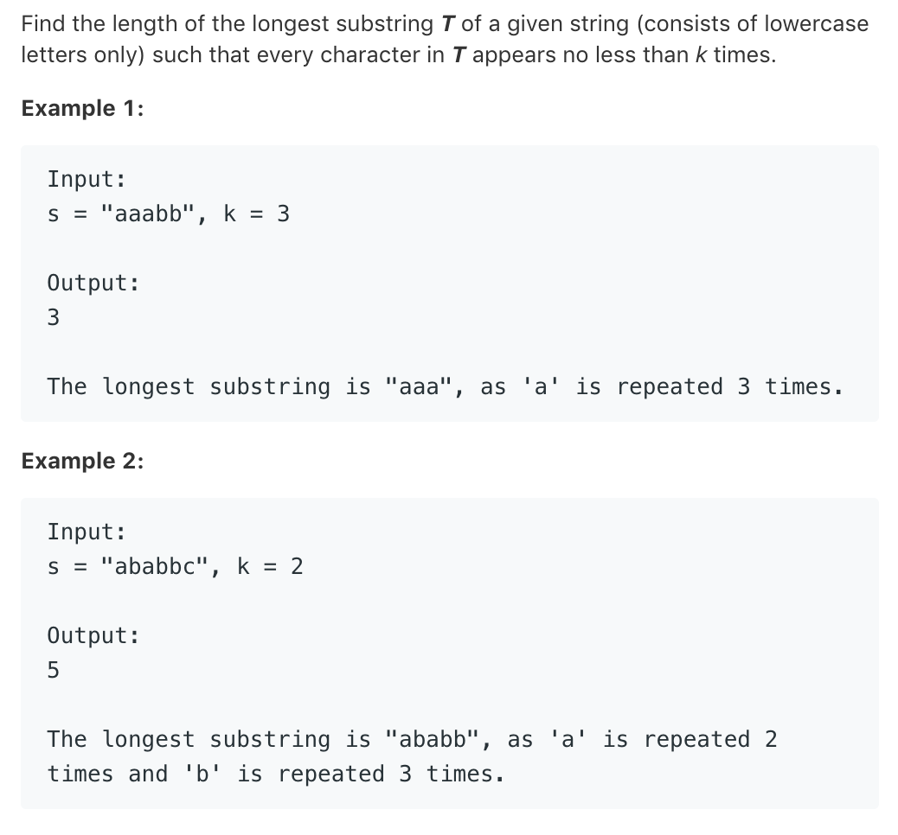

# TOP395.Longest Substring with At least k Repeationg Characters   
### 题目描述   
   

### 解题思路

类似分治的算法（😂rz。学习的大佬

拿到一个字符串 先统计各个字母的数量 

然后看看有没有字母的数量小于K的 ，如果没有 那么就返回字符串长度

如果有 那么就以此字母为轴 把字符串分成俩个字串 重复上述操作

```cpp

class Solution {
public:
    int longestSubstring(string s, int k) {
        if (k < 2) { return s.length(); } // 显然k<2的时候 答案为字符串长度
        if (s.length() < k) { // 显然k大于字符串长度时无解
            return 0;
        }
//        map<char, int> m;
        int m[128] = {0};
        int count = 0;
        for (char c:s) {
            m[c]++;  // 统计字符数量
        }
        int ans = 0;
        bool ok = true;

        int b = 0;
        int e = s.length() - 1;

        while (e - b + 1 >= k && m[s[b]] < k)b++;
        while (e - b + 1 >= k && m[s[e]] < k)e--;

        if (e - b + 1 < k) {
            return 0;
        }

        for (int i = b; i <= e; i++) {
            if (m[s[i]] < k) {
                return max(longestSubstring(s.substr(b, i-b), k), longestSubstring(s.substr(i,e-i+1), k));
            }
        }
        return e-b+1; 
    }
};
```

