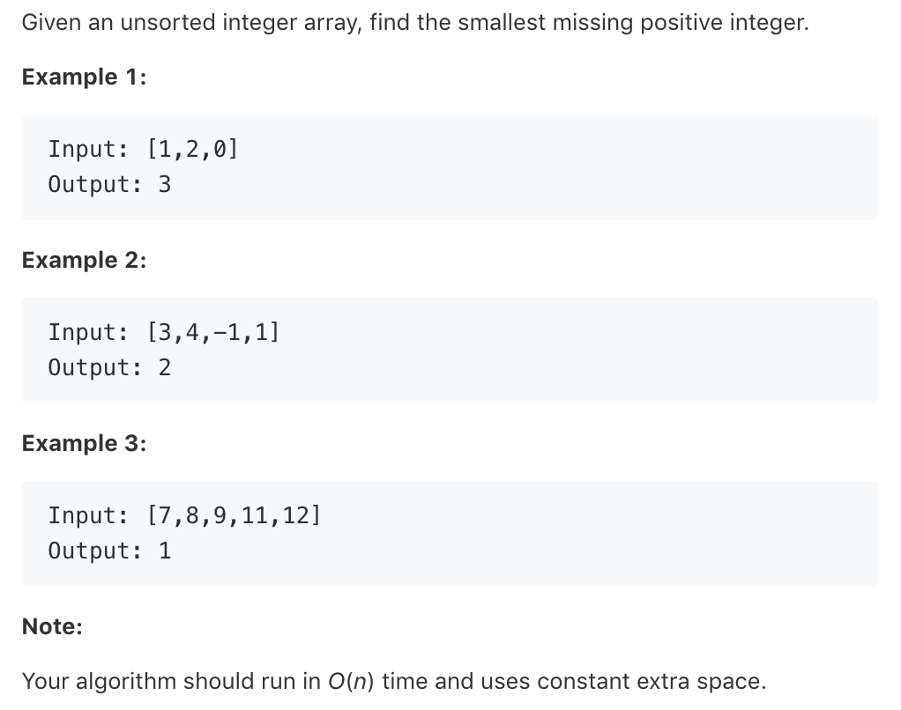

# TOP41.First Missing Positive   
### 题目描述   
   

### 解题思路

c++

```cpp
class Solution {
public:
    int firstMissingPositive(vector<int>& nums) {
        map<int,bool>m;
        for(int n:nums){
            m[n]=true;
        }
        int ans=1;
        while(1){
           if(m[ans])ans++;
           else return ans;
        }
    }
};
```

python 

```python
class Solution:
    def firstMissingPositive(self, nums: List[int]) -> int:
        ans=1
        for i in range(len(nums)):
            if ans in nums:
                ans+=1
        return ans
```

