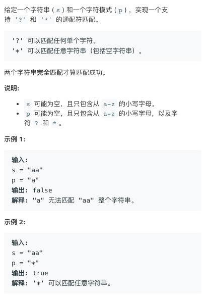
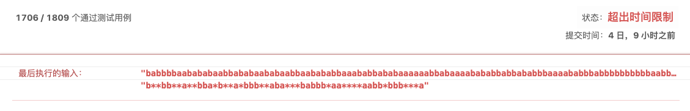

# TOP44.Wildcard Matching   
### 题目描述   



### 解题思路

QAQ自己的方法比较蠢，还有一部分case通不过😂而且代码又臭又长……

首先是优化表达式把一些重复的*给去掉（其实并没有什么用，这个并不是优化点

然后表达式和待匹配文字从头开始匹配，如果是`*`的话，找到`*`后边第一个字母，然后从待匹配的字符串中

找到这个字母的位置，从这里开始继续匹配，中间那一坨就算是用*匹配对上了。



```cpp
class Solution {
public:
    bool isMatch(string s,string p){
        //  对通配符处理一下 比如通配符*** 其实等价于*
        string dealp="";
        int start =0;
        for(int i=0;i<p.length();){
            if(p[i]=='*'){
                dealp+=p.substr(start,end-start+1);
                while(i<p.length()&&p[i]=='*')i++;        
                start=i;
            }
        }
        dealp+=p.substr(start);
        cout<<dealp;
        return Match(s,dealp);
    }
    bool Match(string s, string p) {
        if(p=="*")return true;
        if(s==""&&p=="")return true;
        if(s==""&&p!="")return false;
        if(s!="" &&p=="")return false;
        if(p[0]=='?'){
                   return Match(s.substr(1),p.substr(1));
        }else if(p[0]=='*'){
                   int nonStartIndex=-1;
                   for(int i=1;i<p.length();i++){
                       if(p[i]!='*'){
                           nonStartIndex=i;break;
                       }
                   }
                   if(nonStartIndex==-1)return true;
                   char nextchar=p[nonStartIndex];
                   for(int i=0;i<s.length();i++){
                        if(s[i]==nextchar||nextchar=='?'){
                            if(Match(s.substr(i),p.substr(nonStartIndex)))
                                    return true;
                        }
                   }
        }else{
           if(p[0]==s[0]){
                   return Match(s.substr(1),p.substr(1));
           }
        }
        return false;
    }
};
```

参考了大佬思路附上我的实现（copy：

- s[i] p[j]恰好相同或p[j]为"?",那么i,j同时+1
- p[j]为"#"时，使用一个变量xing记录最后一个#的位置，但是这时不用#来匹配，因为我们希望尽可能使用p中的正常字符来匹配s，不然p中多余的字符就无法匹配了,j跳过# j+1（此时还需要用一个变量match记录遇到*之前可以匹配到的位置）
- 当不满足前两种情况时，也就是当前的p[j]无法匹配s[i]了，我们就要借助已记录的最后一个#来匹配，所以只能含泪清空从最后一次遇到#之后所有正常的匹配，也就是i,j都还原到最后一次遇到#的位置也就是match,xing+1。然后使用#来匹配s中的一个字符，剩下的继续尝试正常匹配，即i = match = match+1
- 当不满足上述三种情况时，说明既无法匹配又没有#了，直接返回False

```cpp
class Solution {
public:
    bool isMatch(string s,string p){
        int sp=0;int pp=0;
        int preStarIndex=-1;
        int preMatchIndex=0;
        while(sp<s.length()){
            if(p[pp]=='?'||p[pp]==s[sp]){
                pp++;
                sp++;
            }
            else if(sp<s.length()&&p[pp]=='*'){
                preMatchIndex=sp;
                preStarIndex=pp;
                pp++;
            }else if(preStarIndex!=-1){
                sp=preMatchIndex=preMatchIndex+1;
                pp=preStarIndex+1;
            }else{
                return false;
            }
        }
        for(;pp<p.length();pp++)if(p[pp]!='*')return false;
        return true;
    }
};
```

