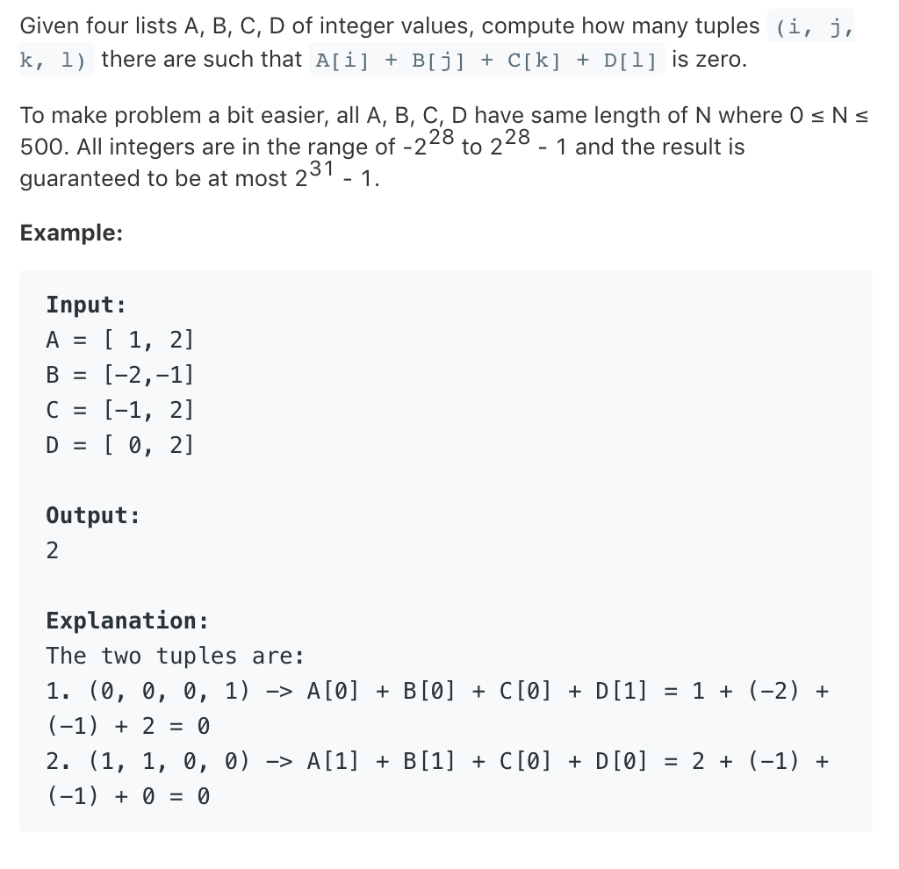

# TOP454.4Sum II   
### 题目描述   
   

### 解题思路

合并A，B成AB

双重遍历C，D

```cpp
class Solution {
public:
    int fourSumCount(vector<int> &A, vector<int> &B, vector<int> &C, vector<int> &D) {
        // 先A和B合并
        map<int,int> AB;
        for (int i = 0; i < A.size(); i++) {
            for (int j = 0; j < B.size(); j++) {
                AB[A[i] + B[j]]++;
            }
        }
        long long ans = 0;
        for(auto c:C)
        for(auto d:D){
            ans+=AB[0-c-d];
        }
        return ans;
    }
};
```

