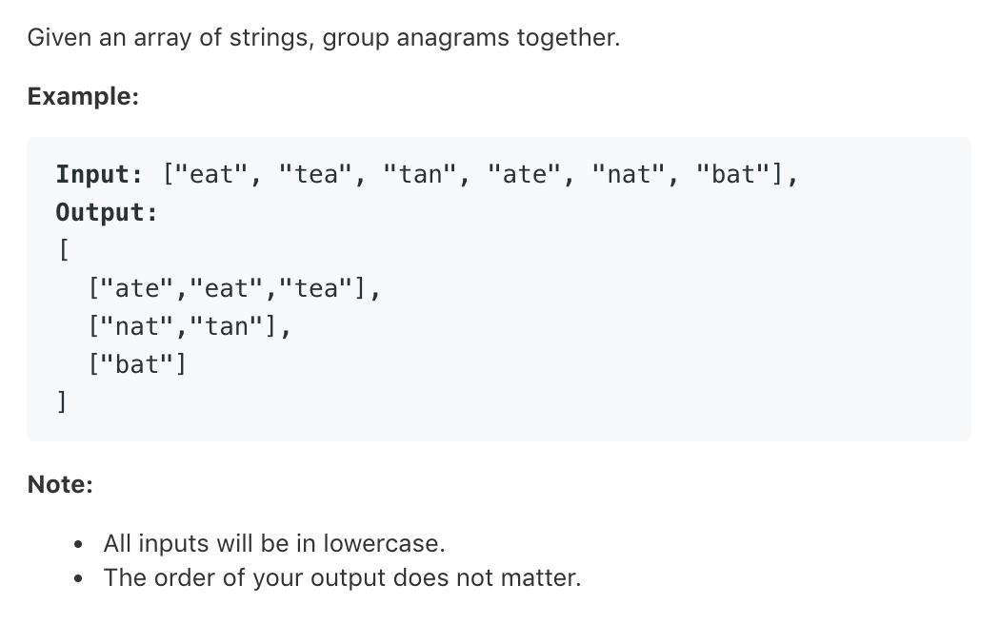

# TOP49.Group Anagrams   
### 题目描述   
   

### 解题思路

整数唯一分解定理

每个字母用一个素数表示

俩个单词如果字母构成完全一样，则每个字母对应素数的乘积应该相同 （得% 否则溢出报错

```cpp
class Solution {
public:
    vector<vector<string>> groupAnagrams(vector<string>& strs) {
        int prime[26] = {2, 3, 5, 7, 11, 13, 17, 19, 23, 29, 31, 41, 43, 47, 53, 59, 61, 67, 71, 73, 79, 83, 89, 97, 101, 103};
        map<int,vector<string>>m;
        for(string str:strs){
            long long count=1;
            // cout<<str<<endl;
            for(char c:str){
                count*=prime[c-'a'];
                count%=10000000000000000;
            }
            m[count].push_back(str);
        }
        vector<vector<string>>ans;
        for(auto it:m){
            ans.push_back(it.second);
        }
        return ans;
    }
};
```

