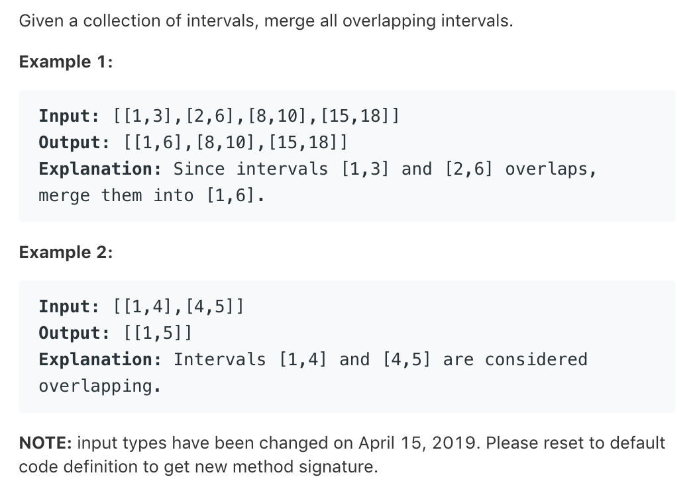

# TOP56.Merge Intervals   
### 题目描述   
   

### 解题思路

先排序  排序方式  起点升序

开始遍历排序后的线段

1.取一条作为基准 B

2.取下一条 N 比较下一条的起点 Ns和基准的结尾 Be

- Ns<=Be  说明B和N有交集。更新Be = max(Be,Ne)
- Ns>Be  没有交集 保存B 然后更新B的值为N 

```c++

class Solution {

public:
    bool cmp(const vector<int> &a, const vector<int> &b) {
        return a[0] < b[0];
    }

    vector<vector<int>> merge(vector<vector<int>> &intervals) {
        if (intervals.size() == 0) {
            return intervals;
        }
        sort(intervals.begin(), intervals.end(), [](const vector<int> &a, const vector<int> &b) {
            return a[0] < b[0];
        });

        vector<vector<int>> ans;
        int _min = intervals[0][0];
        int _max = intervals[0][1];
        for (vector<int> current:intervals) {
            if (current[0] > _max) {
                ans.push_back(vector<int>{_min, _max});
                _min = current[0];
                _max = current[1];
            }else{
                _max = max(_max,current[1]);
            }
        }
        ans.push_back(vector<int>{_min,_max});
        return ans;
    }
};
```

