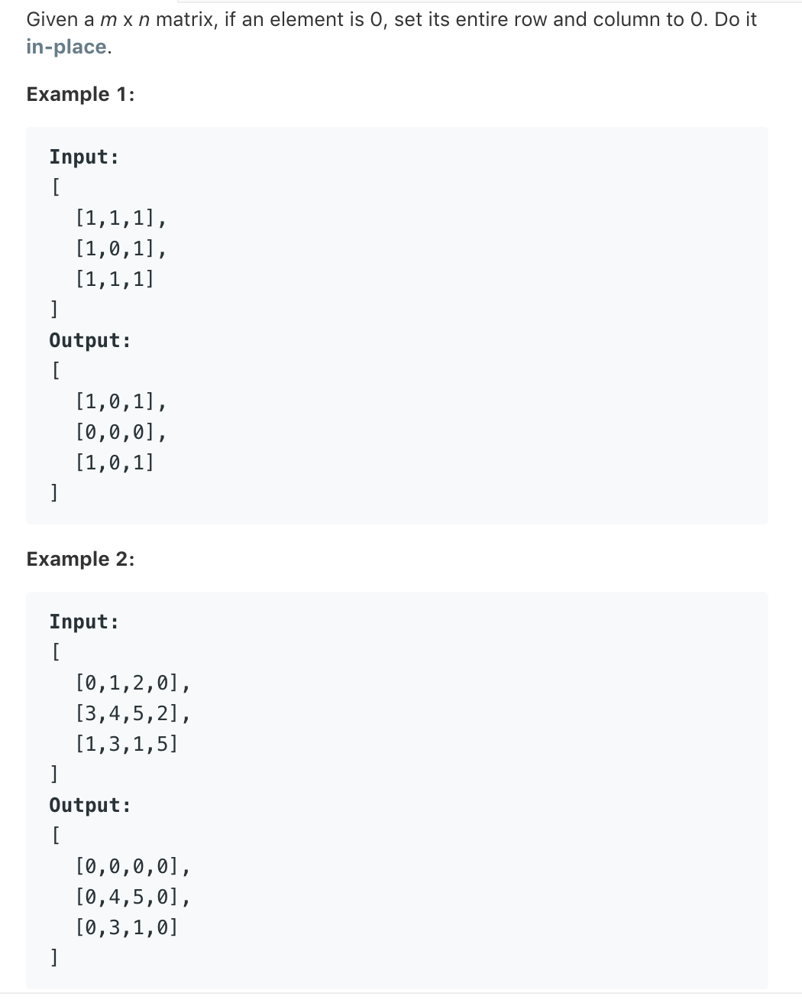

# TOP73.Set Matrix Zeroes   
### 题目描述   
   

### 解题思路

把所有0位置都保存起来

遍历每个0位置，如果当前列或者行没有被清0（该状态用set保存)则清0该行或列 并更新set

```cpp
class Solution {
public:
    void setZeroes(vector<vector<int>>& matrix) {
       int i,j;
       vector<pair<int,int>>v;
       for(i=0;i<matrix.size();i++)
       for(j=0;j<matrix[i].size();j++){
            if(!matrix[i][j]){
               v.push_back(make_pair(i,j));
            }
       }
       set<int>c;
       set<int>l;
       for(auto o:v){
           if(!l.count(o.first)){
                l.insert(o.first);
                for(int i=0;i<matrix.size();i++){
                    matrix[o.first][i]=0;
                }
           }
           if(!c.count(o.second)){
                c.insert(o.second);
                for(int i=0;i<matrix[0].size();i++){
                        martix[i][o.second]=0;
                }
           }
       }
    }
};
```

