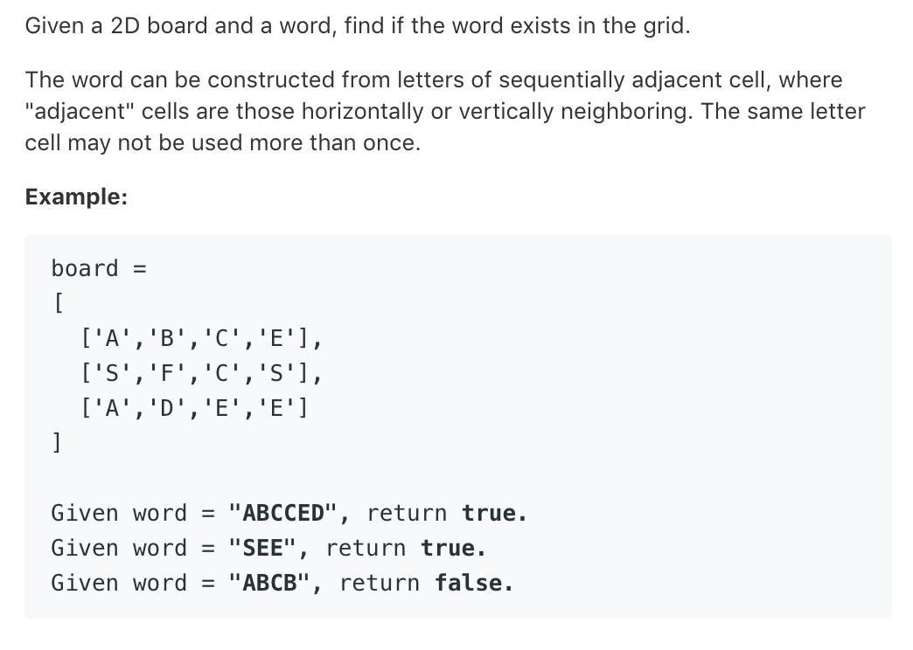

# TOP79.Word Search   
### 题目描述




### 思路

遍历board,找到第一个匹配处然后开始DFS

```cpp
int dirx[4] = {-1, 1, 0, 0};
int diry[4] = {0, 0, -1, 1};
set<pair<int, int> > s;

bool dfs(vector<vector<char>> &board, int x, int y, string &word, int index) {
    if (x < 0 || y < 0 || x >= board.size() || y >= board[0].size())return false;
    if (board[x][y] == word[index++]) {
        if (index == word.length())return true;
        for (int i = 0; i < 4; i++) {
            auto pair = make_pair(x + dirx[i], y + diry[i]);
            if (s.count(pair))continue;
            s.insert(pair);
            if (dfs(board, x + dirx[i], y + diry[i], word, index))return true;
            s.erase(pair);
        }
        return false;
    }
    return false;
}

class Solution {
public:

    bool exist(vector<vector<char>> &board, string word) {
        s.clear();
        for (int i = 0; i < board.size(); i++) {
            for (int j = 0; j < board[0].size(); j++) {
                s.insert(make_pair(i, j));
                if (dfs(board, i, j, word, 0)) {
                    return true;
                }
                s.erase(make_pair(i,j));
            }
        }
        return false;
    }
};

```

代码写的有点啰嗦了