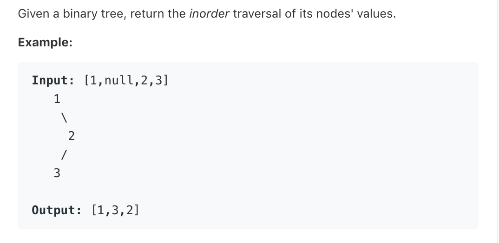

# TOP94.Binary Tree Inorder Traversal   
### 题目描述   
   
### 解题思路

……

```go

var ans = make([]int, 0)

func inorderTraversal(root *TreeNode) []int {
	ans = make([]int, 0)
	inorderTraversalUtil(root)
	return ans
}

func inorderTraversalUtil(root *TreeNode) {
	if root == nil {
		return
	}
	inorderTraversalUtil(root.Left)
	ans = append(ans, root.Val)
	inorderTraversalUtil(root.Right)
}

```