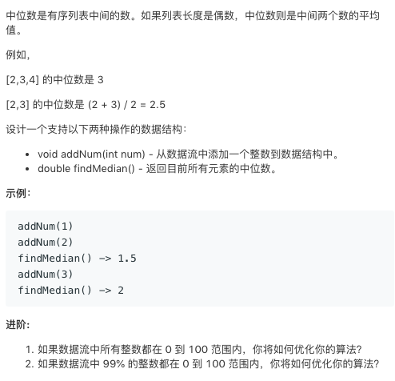

# TOP295.Find Median from Data Stream   
### 题目描述   
   

### 解题思路

维护一个有序数组就行了 但是效率太低了 击败人数少之又少😂

其实可以用多个set 以后再说吧 先打一个flag

```cpp
class MedianFinder {
public:
    /** initialize your data structure here. */
     vector<int>v;    
    MedianFinder() {
       
    }
    
    void addNum(int num) {
       v.insert(upper_bound(v.begin(),v.end(),num),num);
    }
    
    double findMedian() {
       int len = v.size();
       if(len%2){
            return v[len/2];
       }
       return (v[len/2]+v[len/2-1])/2.0;
    }
};

/**
 * Your MedianFinder object will be instantiated and called as such:
 * MedianFinder* obj = new MedianFinder();
 * obj->addNum(num);
 * double param_2 = obj->findMedian();
 */
```

