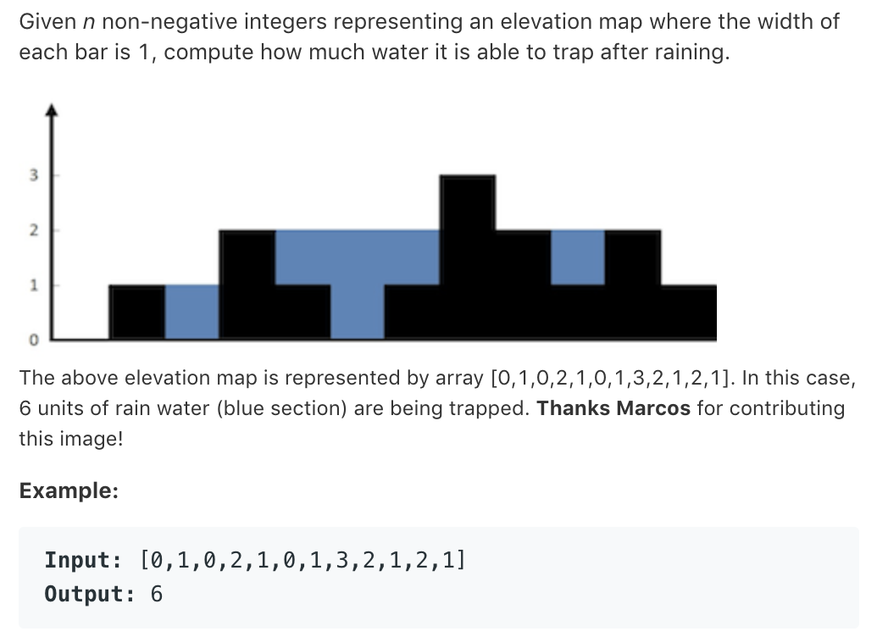

# TOP42.Traping Rain Water   
### 题目描述   
   

### 解题思路

太难了……  看了别人的题解然后自己写的 😂rz

```cpp
class Solution {
public:
    int trap(vector<int>& height) {
        vector<int>left;
        vector<int>right(height.size()+1);
        int _max=0;
        for(auto i:height){
            _max=max(_max,i);
            left.push_back(_max-i);
        }
        _max=0;
        for(int i=height.size()-1;i>=0;i--){
           _max=max(_max,height[i]);
          right[i]=_max-height[i]; 
        }
        int ans=0;
        for(int i=0;i<height.size();i++){
            ans+=min(right[i],left[i]);
        }
        return ans;
    }
};
```

双指针

```cpp
class Solution {
public:
    int trap(vector<int>& height) {
        int left=0,right=height.size()-1;
        int ans=0,lm=0,rm=0;
        while(left<right){
            if(height[left]>height[right]){
               rm=max(rm,height[right]);
               ans+=rm-height[right];
               right--;
            }else{
                lm=max(lm,height[left]);
                ans+=lm-height[left];
                left++;
            }
        }
        return ans;
    }
};
```

