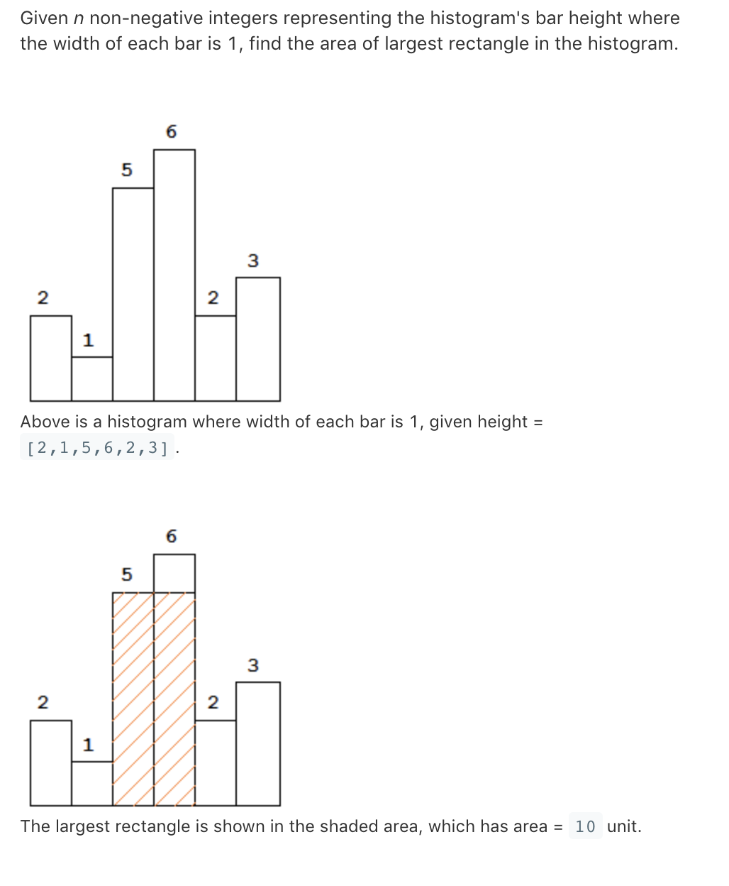

# TOP84.Largest Rectangle In Histogram   
### 题目描述   
   
### 解题思路

- 两重循环+剪枝（自己想的方法，不过最后有个case过不去
```cpp
// TL 95/96
class Solution {
public:
    int largestRectangleArea(vector<int>& heights) {
        int ans=0;
        for(int i=0;i<heights.size();i++){
            int _min=heights[i]; 
            if(i&&heights[i]<=heights[i-1])continue;
            for(int j=i;j<heights.size();j++){
               _min=min(_min,heights[j]);
               if(ans>(heights.size()-i)*_min)break;
               ans=max(ans,(j-i+1)*_min);
            }
        }
        return ans;
    }
};

```
- 分治法    
分治法比较风骚，找一个最矮的矩形，计算包括它能构成的最大面积和不包括它能构成的最大面积然后取最大值返回结果   
如果包含 s=(end-start)*height_of_minHeight_rectangle     
如果不包含 s=max(最矮矩形左边区域构成的最大面积,最矮矩形右边区域构成的最大面积)
```cpp
class solution {
public:
    int largestrectanglearea(vector<int>& heights) {
        return largest(heights,0,heights.size());
    }
    int largest(vector<int>&heights,int start,int end){
        if(start==end)return 0;
        if(start+1==end)return heights[start]; 
        int min_index=0;
        for(int i=start;i<end;i++){
            if(heights[i]<heights[min_index])min_index=i;
        }
        return max(heights[min_index]*(end-start),largest(heights,start,min_index),largest(heights,min_index+1,end));
    }
};

```
- 线段树+分治
分治过程中每次查找最小高度矩形是依次遍历     
用线段树可以优化这个查询过程
```cpp

class SegTreeNode {
public:
  int start;
  int end;
  int min;
  SegTreeNode *left;
  SegTreeNode *right;
  SegTreeNode(int start, int end) {
    this->start = start;
    this->end = end;
    left = right = NULL;
  }
};

class Solution {
public:
  int largestRectangleArea(vector<int>& heights) {
    if (heights.size() == 0) return 0;
    SegTreeNode *root = buildSegmentTree(heights, 0, heights.size() - 1);
    return calculateMax(heights, root, 0, heights.size() - 1);
  }
  
  int calculateMax(vector<int>& heights, SegTreeNode* root, int start, int end) {
    if (start > end) {
      return -1;
    }
    if (start == end) {
      return heights[start];
    }
    int minIndex = query(root, heights, start, end);
    int leftMax = calculateMax(heights, root, start, minIndex - 1);
    int rightMax = calculateMax(heights, root, minIndex + 1, end);
    int minMax = heights[minIndex] * (end - start + 1);
    return max( max(leftMax, rightMax), minMax );
  }
  
  SegTreeNode *buildSegmentTree(vector<int>& heights, int start, int end) {
        if(start>end)return NULL;
        SegTreeNode* root = new SegTreeNode(start,end);
        if(start==end)root->min=start;
        else{
            int mid=start+(end-start)/2;
            root->left=buildSegmentTree(heights,start,mid);
            root->right=buildSegmentTree(heights,mid+1,end);
            root->min=heights[root->left->min]>heights[root->right->min]?root->right->min:root->left->min;
        }
        return root;
  }
  
  int query(SegTreeNode *root, vector<int>& heights, int start, int end) {
        if(end<root->start||start>root->end)return -1;
        if(start<=root->start&&end>=root->end)return root->min;
        int left_min_index=query(root->left,heights,start,end);
        int right_min_index=query(root->right,heights,start,end);
        if(left_min_index==-1)return right_min_index;
        if(right_min_index==-1)return left_min_index;
        return heights[left_min_index]>heights[right_min_index]?right_min_index:left_min_index;
  }
};

```