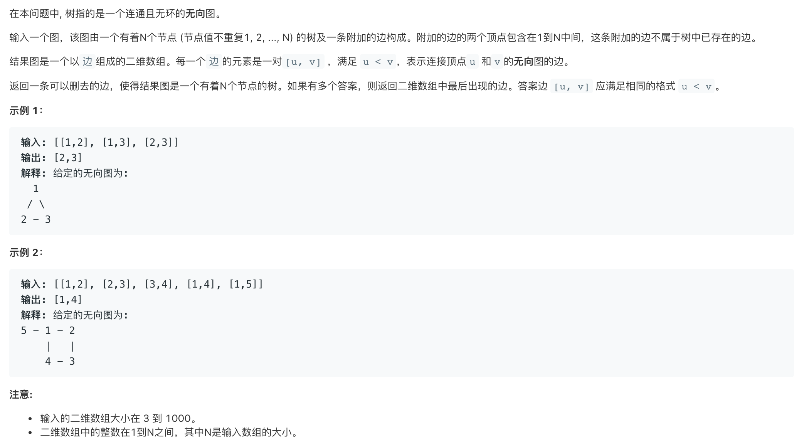

# 684.冗余链接🔗   
### 题目描述   



### 解题思路

对于每一组边 ，查看这俩个是否在同一个集合中就行了。如果在的话，加上这条边，那这一棵树肯定有环了

### code

```cpp
#include <bits/stdc++.h>
using namespace std;

class Solution {
public:
  int f[1005];
  vector<int> findRedundantConnection(vector<vector<int>> &edges) {
    for (int i = 0; i <= edges.size(); i++)
      f[i] = i;
    for (auto &edge : edges) {
      if (find(edge[0]) == find(edge[1]))
        return edge;
      join(edge[0], edge[1]);
    }
    return edges[0];
  }

  int find(int x) {
    if (f[x] == x)
      return x;
    f[x] = find(f[x]);
    return f[x];
  }

  void join(int a, int b) {
    int fa = find(a);
    int fb = find(b);
    if (fa == fb)
      return;
    // 不管优先权了 Orz;
    f[fa] = fb;
  }
};
```

