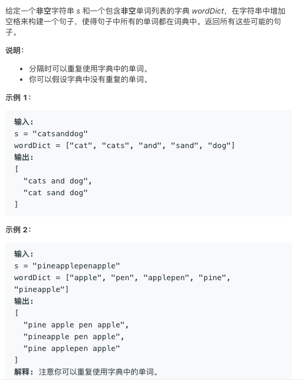

# TOP140.Word Break II   
### 题目描述   
   

### 解题思路

介个题和单词拆分第一个版本有所不同 ，第一个版本就问了能不能拆分，介个版本要把所有拆分都给列举

粗暴的DFS不行 得带记忆才行。配合map食用

```cpp
class Solution {
public:
    unordered_map<string,vector<string>>um;
    unordered_set<string>us;
    vector<int>steps;
    vector<string> wordBreak(string s, vector<string>& wordDict) {
        set<int>tmps; 
        for(string&w:wordDict){
            tmps.insert(w.length());
            us.insert(w);
        }
        steps.assign(tmps.begin(),tmps.end());
        return get(s);
        
    }
    vector<string> get(string s){
       if(s=="")return vector<string>({});
       if(um.count(s))return um[s];
       vector<string>ans;
       for(auto step:steps){
            if(step>s.length())break;
            string prefix = s.substr(0,step);
            if(!us.count(prefix))continue;
            if(step==s.length()){
                ans.push_back(prefix);
                break;
            }
            auto res=get(s.substr(step));
            if(res.size()==0)continue;
            for(string& str:res){
                ans.push_back(prefix+" "+str);
            }
        }
        um[s]=ans;
        return ans;
    }
};
```

