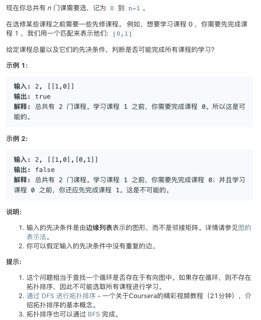

# TOP207.Course Schedule   
### 题目描述   
   

### 解题思路

 拓扑排序 方法如下 

```cpp
class Solution {
public:
    set<int>s;
    set<int>c;
    bool canFinish(int numCourses, vector<vector<int>>& prerequisites) {
        vector<vector<int>>g(numCourses+1);
        for(auto p:prerequisites){
            g[p[0]].push_back(p[1]);
        }
        for(int i=0;i<numCourses;i++){
            if(s.count(i))continue;
            s.insert(i);
            c.clear();
            c.insert(i);
            if(!topSort(i,g))return false;
        }
        return true;
    }
    bool topSort(int n,vector<vector<int>>& g){
        if(g[n].size()==0){
            return true;
        }
        for(int cs:g[n]){
            if(c.count(cs))return false;
            if(s.count(cs))continue;
            c.insert(cs);
            s.insert(cs);
            if(!topSort(cs,g))return false;
            c.erase(cs);
        }
        return true;
    }
};
```

​        

上边的方法逻辑比较混乱

下边是dfs的方法。判断的同时顺便还能输出拓扑排序的结果

```cpp
class Solution {
public:
    vector<vector<int>> g;
    int *vis;
    int *top;

    bool canFinish(int numCourses, vector<vector<int>> &prerequisites) {
        g.assign(numCourses, vector<int>(0));
        vis = new int[numCourses];
        top = new int[numCourses];
        for (int i = 0; i < numCourses; i++)vis[i] = 0;
        for (auto c : prerequisites) {
            g[c[1]].push_back(c[0]);
        }
        int course = numCourses - 1;
        for (int i = 0; i < numCourses; i++) {
            if (!vis[i]) {
                course = topological(course, i);
                if (course == -2)return false;
            }
        }

       // for (int i = 0; i < numCourses; i++) {
       //     cout << top[i] << " ";
       // }

        return true;
    }

    int topological(int num, int cur) {
        vis[cur] = 1;
        for (int next:g[cur]) {
            if (vis[next] == -1)continue;
            if (vis[next] == 1)return -2;
            num = topological(num, next);
            if (num == -2)return -2;
        }
        top[num] = cur;
        vis[cur] = -1;
        return --num;
    }
};
```

关于拓扑排序，文件夹内还有一个教学视频

