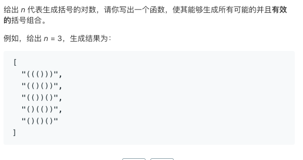

# TOP22.Generate Parentheses   
### 题目描述   
   

### 解题思路

递归版本。

L和R表示左括号和右括号使用的数量，每次添加一个括号（左或者右

如果从某一次开始右括号用的比左括号多，那就肯定不合法

当俩个括号都用完的时候。答案就出来了

但是递归的效率有点低，只能击败50%

```go

var ans []string
//var m map[string]bool

func generateParenthesis(n int) []string {
	//m = make(map[string]bool)
	ans = make([]string, 0)
	recursive("", 0, 0, n)
	return ans
}

func recursive(str string, l, r, n int) {
	if r > l || r > n || l > n {
		return
	}
	if l == n && r == n {
		ans = append(ans, str)
	}
	recursive(str+"(", l+1, r, n)
	recursive(str+")", l, r+1, n)
}
```

把左右括号看成0和1

括号的排列就是01组合排列

所以只要遍历每一种可能就行了

但是遍历的范围如何计算呢

假设`n=4`

下边的代码1表示左括号0表示右括号

合法最大值自然是`(((())))=11110000`

合法最小值是`()()()()=10101010`

```go

func generateParenthesis(n int) []string {
	ans := make([]string, 0)
	for i := MIN(n); i <= MAX(n); i++ {
		if ok, str := Check(n*2, i); ok {
			//reversal(str)
			ans = append(ans, string(str))
		}
	}
	return ans
}

func MAX(n int) int {
	return 1<<uint(2*n) - 1<<uint(n)
}

func MIN(n int) int {
	min := 0
	for i := 0; i < n*2; i += 2 {
		min += 1 << uint(i+1)
	}
	return min
}

func Check(size, n int) (bool, []byte) {
	var buffer bytes.Buffer
	weight := 0
	base := 1 << uint(size-1)
	for {
		if n&base == base {
			weight += 1
			buffer.WriteByte('(')
		} else {
			weight -= 1
			buffer.WriteByte(')')
			if weight < 0 {
				return false, []byte{}
			}
		}
		n <<= 1
		size--
		if size == 0 {
			return weight == 0, buffer.Bytes()
		}
	}
}
```

