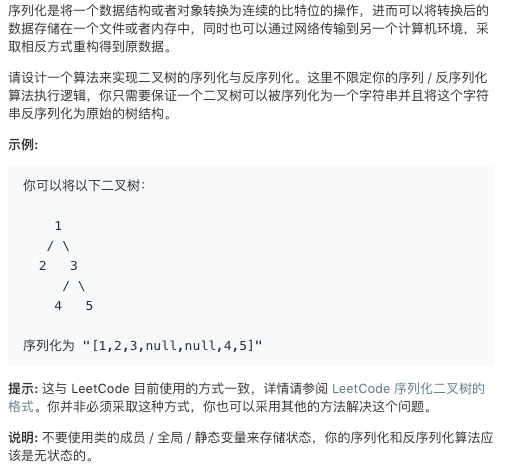

# TOP297.serialize and Deserialize Binary Tree   
### 题目描述   
   

### 解题思路

一开始没理解错了题目，其实序列化的结果是不需要输出的，因为判题的方法是给一颗树然后用序列化函数的结果放到反序列化函数中去看看得到的树和原来的树🌲一样不

所以本来我用的是广搜 就为了 序列化的结果能和数组一样好看

然后后来知道了才改成了深搜，没有啥技巧。小心写就行了

vim大法好QAQ😂

```cpp
/**
  47/48 最后一个case没通过
 * Definition for a binary tree node.
 * struct TreeNode {
 *     int val;
 *     TreeNode *left;
 *     TreeNode *right;
 *     TreeNode(int x) : val(x), left(NULL), right(NULL) {}
 * };
 */
class Codec {
public:

    // Encodes a tree to a single string.
    string serialize(TreeNode* root) {
        string ans="[";
        TreeToString(root,ans); 
        ans[ans.length()-1]=']';
        return ans;
    }
    void TreeToString(TreeNode*root,string&out){
        if(root==NULL){
            out+="null,";
            return;
        }
        out+=to_string(root->val)+",";
        TreeToString(root->left,out);
        TreeToString(root->right,out);
    }
    // Decodes your encoded data to tree.
    TreeNode* deserialize(string data) {
        int index=0;
        return buildTree(data,index);
    }

    TreeNode* buildTree(string&input,int&index){
        int num=Read(input,index);
        if(num==INT_MAX){
            return NULL;    
        }
        TreeNode*root=new TreeNode(num);
        root->left=buildTree(input,index);
        root->right=buildTree(input,index);
        return root;
    }
    int Read(string&input,int& index){
        int ans=0;
        int sign=1;
        for(int i=index;i<input.length();i++){
             if(input[i]=='[')continue; 
             if(input[i]=='n'){
                i+=5;
                index=i;
                return INT_MAX;
             } 
             if(input[i]=='-'){
                sign=-1;
                continue;
             }
             if(input[i]==','||input[i]==']'){
                index=i+1;
                return ans*sign;
             }
             ans*=10;
             ans+=input[i]-'0';
        }
        return INT_MAX;
    }

};

// Your Codec object will be instantiated and called as such:
// Codec codec;
// codec.deserialize(codec.serialize(root));
```

