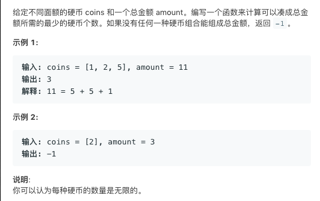

# TOP322.Coin Change   
### 题目描述   
   
### 解题思路

简单动态规划

`dp[i]`表示总金额为`i`的最少硬币数量

假设有一个5元硬币

则`dp[i]=min(dp[i],dp[i-5]+1)`  

```go
func coinChange(coins []int, amount int) int {
	dp := make([]int,amount+1)
	dp[0] = 0
	sort.Ints(coins)
	for money := 1; money <= amount; money++ {
		dp[money] = -1
		for i := 0; i < len(coins); i++ {
			if money-coins[i] < 0 {
				break
			}
			if dp[money-coins[i]] == -1 {
				continue
			} else {
				if dp[money] == -1 {
					dp[money] = dp[money-coins[i]] + 1
				} else if dp[money] > dp[money-coins[i]]+1 {
					dp[money] = dp[money-coins[i]] + 1
				}
			}
		}
	}
	return dp[amount]
}
```