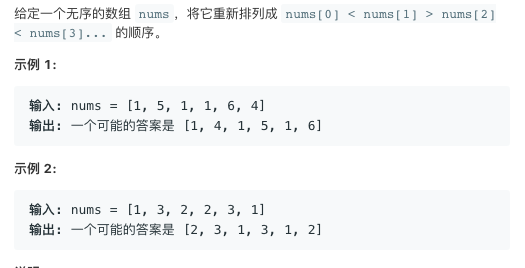

# TOP324.Wiggle Sort II   
### 题目描述   
   

### 解题思路

排序 然后分成两份 交替使用 构成答案数组

```go
func wiggleSort(nums []int) {
	tmp := make([]int, len(nums))
	copy(tmp, nums)
	sort.Ints(tmp)
	i, j := len(nums), (len(nums)+1)/2
	for k := 0; k < len(nums); k++ {
		if k&1 == 0 {
			j--
			nums[k] = tmp[j]
		} else {
			i--
			nums[k] = tmp[i]
		}
	}
}
```

