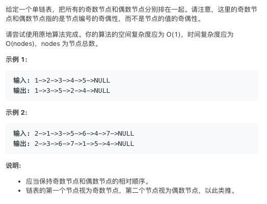

# TOP328.Odd Even Linked List   
### 题目描述   
   

### 解题思路

基础题😂 就是写的有点啰嗦

```cpp
 * Definition for singly-linked list.
 * struct ListNode {
 *     int val;
 *     ListNode *next;
 *     ListNode(int x) : val(x), next(NULL) {}
 * };
class Solution {
public:
    ListNode* oddEvenList(ListNode* head) {
       if(head==NULL)return head;
       ListNode* odd,pre,cur;
       odd=head;
       cur=head->next;
       pre=odd;
       bool even=true;
       while(cur){
        if(even){
            pre=cur;
            cur=cur->next;
        }else{
            pre->next=cur->next;
            cur->next=odd->next;
            odd->next=cur;
            odd=cur;
            odd=pre->next;
        }
        even=!even;
       }
       return head;
    }
};
```

