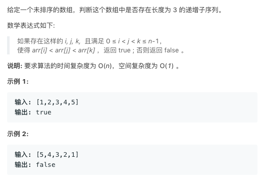

# TOP334.Increasing Triplet Subsequence   
### 题目描述   
   

### 解题思路

看注释

```go
func increasingTriplet(nums []int) bool {
	if len(nums) < 3 { // 显然不符合
		return false
	}
	min := nums[0]
	var mid int
	i := 1
  // 先找出 小 和 中
	for ; i < len(nums); i++ {
		if nums[i] > min {
			mid = nums[i]
			break
		} else {
			min = nums[i]
		}
	}
  // 如果小和中找到了 然后已经到了尽头 
	if i == len(nums) {
		return false
	}
	for ; i < len(nums); i++ {
		if nums[i] > mid { // 如果大于mid 显然OK
			return true
		} else {
      // 否则 
			if nums[i] > min {
        // mid>nums[i]>min 更新mid 
				mid = nums[i]
			} else {
        // 更新 mid 和 min
        mid=mid
				min = nums[i]
			}
		}
	}
	return false
}
```

