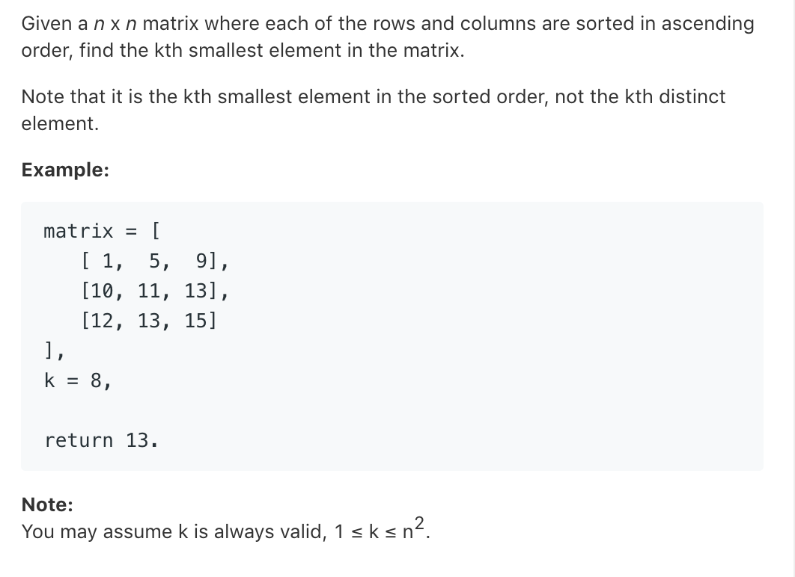

# TOP378.Kth Smallest Element in a Sorted Matrix   
### 题目描述   
   

### 解题思路

 介个题目！得二分，然鹅，不仅仅是在矩阵的行和列中二分（当然也是看的题解😂

```cpp
class Solution {
public:
    int kthSmallest(vector<vector<int>>& matrix, int k) {
        int low=matrix[0][0]; //最小值
        int high=matrix.back().back(); //最大值
        while(low<high){
            mid=(low+high)/2;
            int count=0;
            for(auto line:matrix){
                count+=upper_bound(line.begin(),line.end(),mid)-line.begin(); // 从矩阵里寻找小于等于mid的数量 然后累加
            }
            if(count>=k){  
                high=mid;
            }else{
                low=mid+1;
            }
        }
        return low;
    }
};
```
