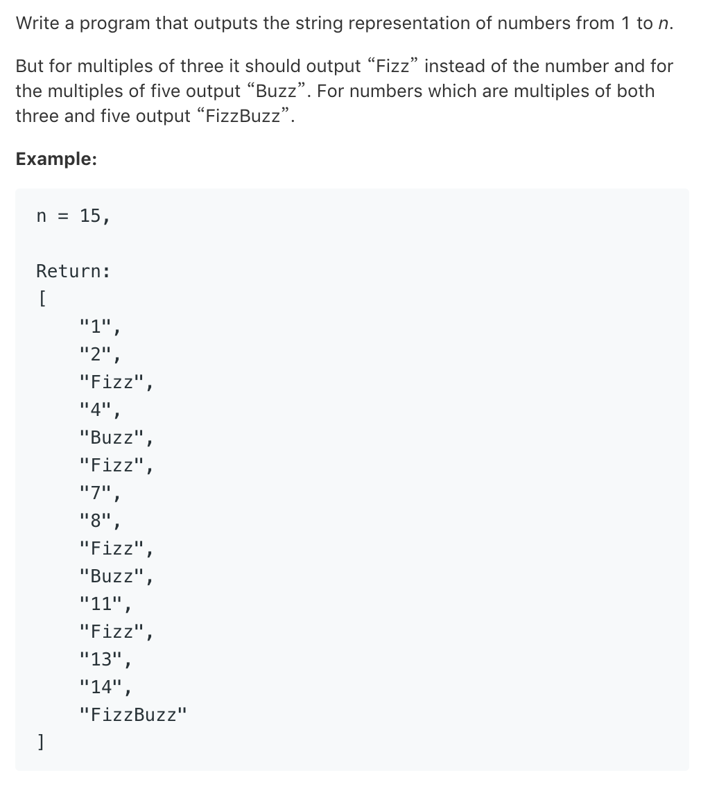

# TOP412.Fizz Buzz   
### 题目描述   
   

### 解题思路

简单题 没有动手写 

不过看了大牛的py 相当简洁 牛逼

```python
class Solution:
    def fizzBuzz(self, n: int) -> List[str]:
        return ['Fizz' * (not i % 3) + 'Buzz' * (not i % 5) or str(i) for i in range(1, n+1)]
```

