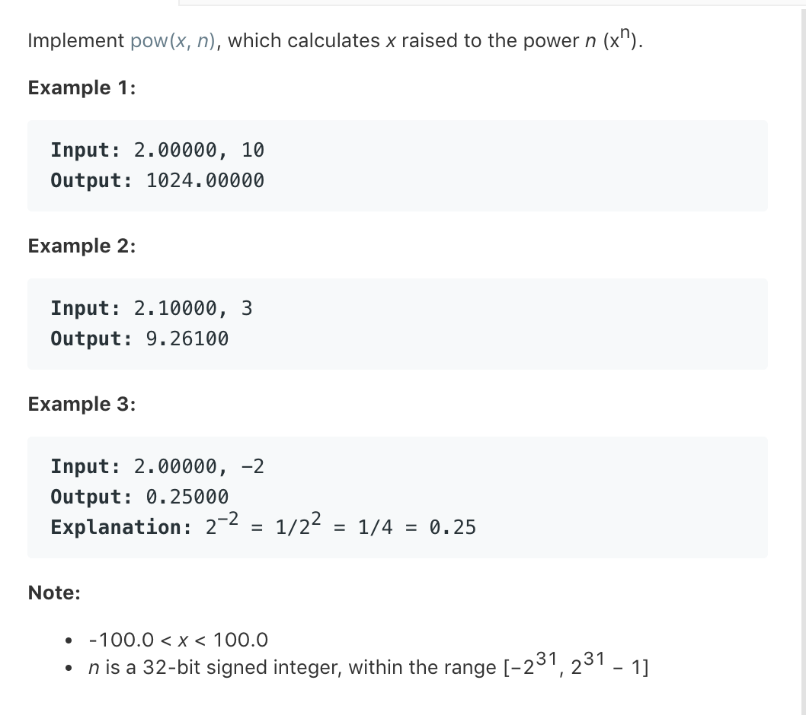

# idea

## Pow(x,n)

### 题目描述

 

##### 使用快速幂

对于n为正数的情况，快速幂的递归实现如下

```
 func fastPow(x float64, n int) float64 {
  if n == 0 {
    return 1.0
  }
  half := fastPow(x, n/2)
  if n%2 == 0 {
    return half * half
  }
  return half * half * x
}
```

 对于n等于负数时

 x^n = 1/x^(-n)