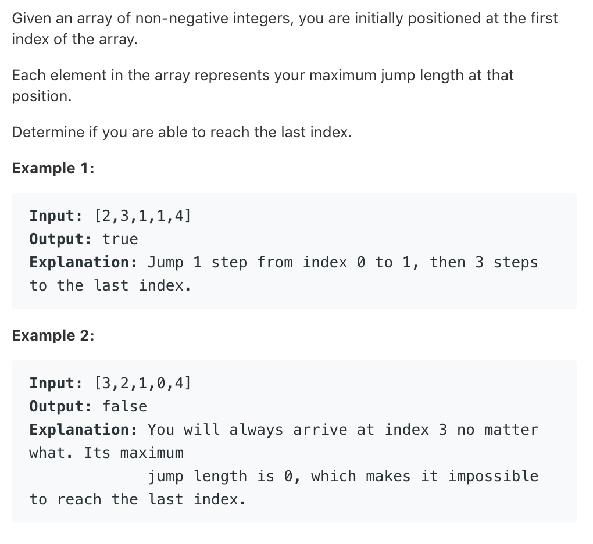

# TOP55.Jump Game   
### 题目描述   
   
### 解题思路

直接上代码
```go
func canJump(nums []int) bool {
	dp := make([]bool, len(nums))
	for i := 0; i < len(nums); i++ {
		dp[i] = false
	}
	dp[0] = true
	for i := 0; i < len(nums); i++ {
		if dp[i] {
			for j := 1; i+j < len(nums)&&j<=nums[i]; j++ {
				dp[i+j] = true
			}
		}
	}
	return dp[len(nums)-1]
}
```
dp[i] 表示 第i个位置能否到达
