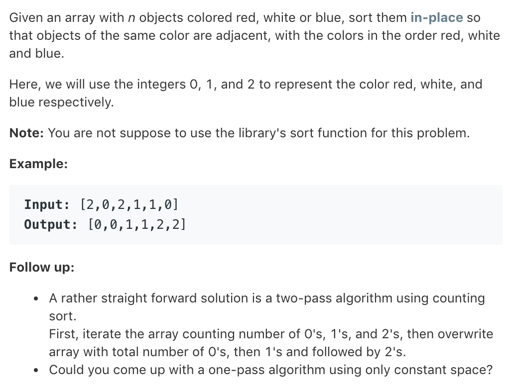

# TOP75.Sort Colors   
### 题目描述   
   

### 解题思路

……

#### code

```cpp
class Solution {
public:
    void sortColors(vector<int>& nums) {
        int count[3]={0};
        for(auto it=nums.begin();it!=nums.end();it++){
            count[*it]++;
        }
        int index=0;
        for(int i=0;i<3;i++){
            while(count[i--])nums[index]=i;
        }
    }
};
```

