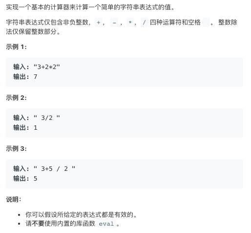

# TOP227.Basic Calculator   
### 题目描述   
   

### 解题思路

 介个题目是一个阉割版本的表达式求值

数据结构课上有带括号的小数的。老师的做法是用栈把表达式改成逆波兰表达式

下面的没有用逆波兰 用的是表达式的递归定义求值 虽然臭长 但是通用于解决未阉割版本（不过这里我没写处理

#### 表达式的递归定义如下

表达式=项之间的加减操作

项=因子的乘除操作

因子=单个数字或者一个表达式

#### 吐槽

数据结构课都没咋去听，老师只会念PPT，念代码

检查代码的方式竟然是自己输入case然后给老师看结果，竟然没有网上测评

```go
var str string
var index int

func calculate(s string) int {
	str = s
	index = 0
	return getExpresionValue()
}

func getExpresionValue() int {
	itemA := getItemValue()
	for {
		if index >= len(str) {
			break
		}
		getRidOfSpan()
		op := str[index]
		if op == '-' {
			index++
			itemA -= getItemValue()
		} else if op == '+' {
			index++
			itemA += getItemValue()
		}
	}
	return itemA
}

func getItemValue() int {
	factorA := getFactorValue()
	for {
		if index >= len(str) {
			break
		}
		getRidOfSpan()
		op := str[index]
		if op == '/' {
			index++
			factorA /= getFactorValue()
		} else if op == '*' {
			index++
			factorA *= getFactorValue()
		} else {
			break
		}
	}
	return factorA
}

func getFactorValue() int {
	val := 0
	for {
		if index >= len(str) {
			break
		}
		if str[index] == ' ' {
			index++
			continue
		}
		if isDigit(str[index]) {
			val = val*10 + int(str[index]-'0')
			index++
		} else {
			break
		}
	}
	return val
}

func isDigit(c byte) bool {
	return c >= '0' && c <= '9'
}

func getRidOfSpan() {
	for {
		if index >= len(str) {
			break
		}
		if str[index] == ' ' {
			index++
		} else {
			break
		}
	}
}
```


打个flag 回头把逆波兰的做法给补上