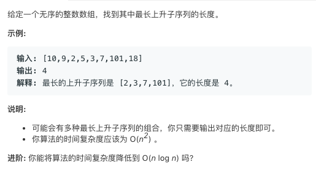

# TOP300.Longest Increasing Subsequence   
### 题目描述   
   

### 解题思路

dp 题  已经写过好多次的 现在写`O(n^2)`比较轻松

`O(n logn)` 的 方法 以后再说😂先打个flag

```cpp

class Solution {
public:
    int lengthOfLIS(vector<int> &nums) {
        if(nums.size()==0){
            return 0;
        }
        int *dp = new int[nums.size() + 1];
        int i, j;
        dp[0] = 1;
        int _max = 1;
        for (i = 1; i < nums.size(); i++) {
            dp[i] = 1;
            for (j = 0; j < i; j++) {
                if (nums[i] > nums[j]) {
                    dp[i] = max(dp[j] + 1, dp[i]);
                }
            }
            _max = max(_max, dp[i]);
        }
        return _max;
    }
};
```

