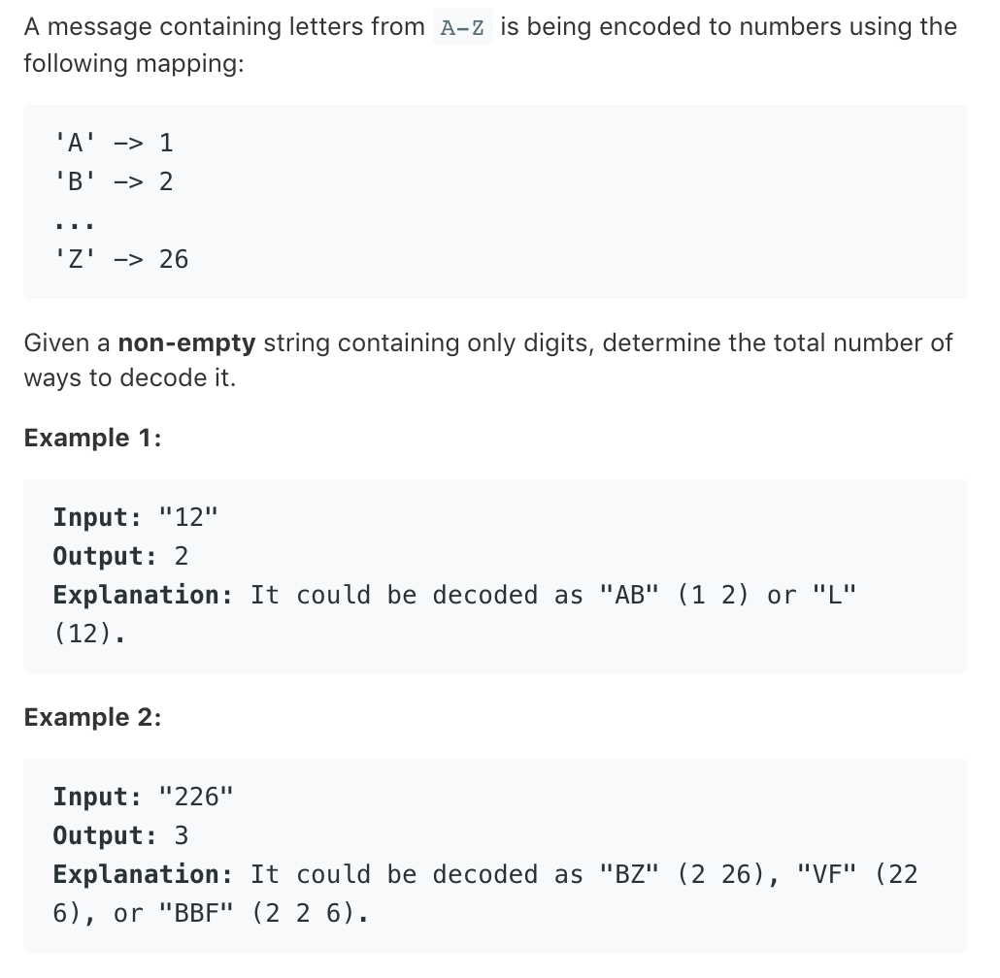

# TOP91.Decode Ways   
### 题目描述   
   
### 解题思路

写的有点啰嗦

dp[i] 表示 字符串s [:i+1] 的答案 

方法不太好… 很多啰嗦的代码都是为了防止边界条件报错

这才没几天就有点难了看懂自己的代码 😂

```go

func numDecodings(s string) int {

	if s[0] == '0' { // 0 开头肯定无解
		return 0
	}

	dp := make([]int, len(s))
	dp[0] = 1

	if len(s) == 1 {
		return 1
	}

	if judge(s[0:2]) && s[1] != '0' {
		dp[1] = 2
	} else {
		dp[1] = 1
	}

	if !judge(s[0:2]) && s[1] == '0' {
		return 0
	}

	for i := 2; i < len(s); i++ {
		dp[i] = 0
		if s[i] != '0' {
			dp[i] = dp[i-1]
		}
		if judge(s[i-1 : i+1]) {
			dp[i] += dp[i-2]
		}
		if dp[i] == 0 {
			return 0
		}
	}

	return dp[len(s)-1]
}

// 给定一字符串 判断其是否在 “ 1-26  ” 之间
func judge(str string) bool {
	if len(str) == 1 && str[0] != '0' {
		return true
	}
	if len(str) == 0 || str[0] == '0' || len(str) > 2 || str[0] > '2' {
		return false
	}
	if str[0] == '2' && str[1] > '6' {
		return false
	}
	return true
}

```